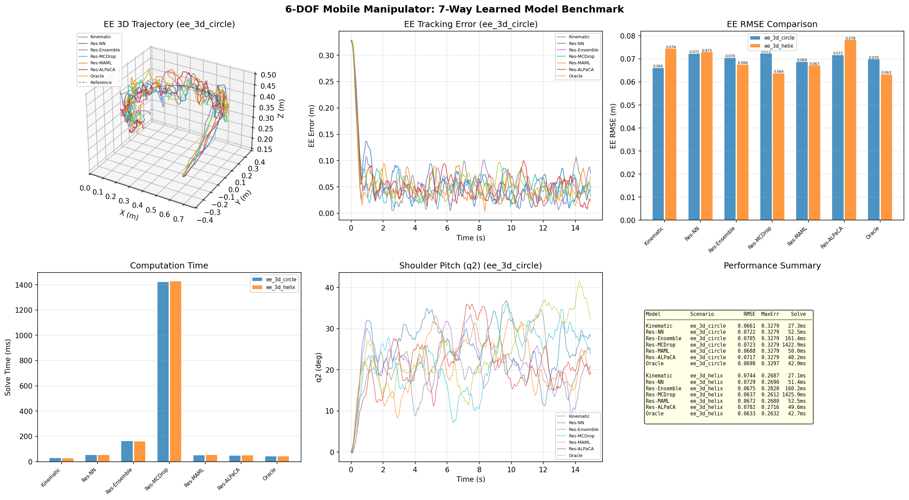
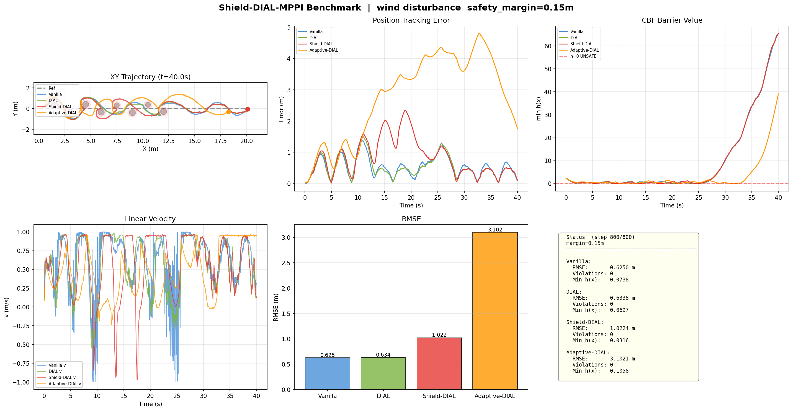
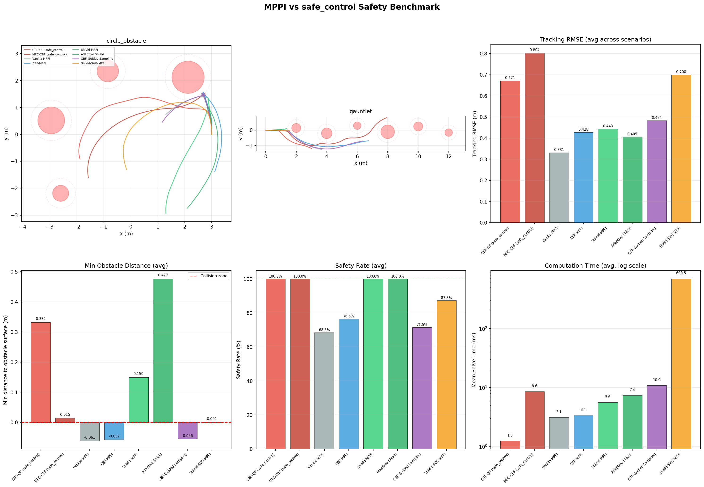
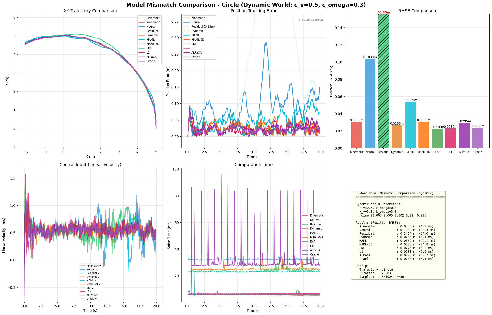
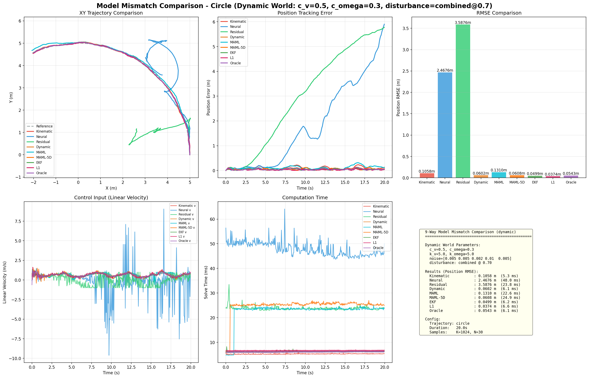

# MPPI - Model Predictive Path Integral Control

[](https://www.python.org/)
[](LICENSE)
[](tests/)

A comprehensive MPPI (Model Predictive Path Integral) control library featuring 27 SOTA variants, **22 safety-critical control methods**, 14 learning models, 5 robot model types, GPU acceleration, learning-based dynamics, MAML meta-learning, post-MAML adaptation (EKF/L1/ALPaCA), **Conformal Prediction + CBF** for distribution-free dynamic safety margins, **Evidential Deep Learning (EDL)** for single-pass aleatoric/epistemic uncertainty separation, **SimulationHarness** for unified multi-controller comparison, **robot body rendering** (circle/car/rectangle patches), and **safety visualization overlay** (CBF contour/collision cone).

## Key Features

### 27 MPPI Variants

| # | Variant | Reference | Key Feature |
|---|---------|-----------|-------------|
| 1 | **Vanilla MPPI** | Williams et al., 2016 | Baseline implementation |
| 2 | **Tube-MPPI** | Williams et al., 2018 | Disturbance robustness |
| 3 | **Log-MPPI** | - | Numerical stability (log-space softmax) |
| 4 | **Tsallis-MPPI** | Yin et al., 2021 | Exploration/exploitation tuning |
| 5 | **Risk-Aware MPPI** | Yin et al., 2023 | CVaR-based conservative control |
| 6 | **Smooth MPPI** | Kim et al., 2021 | Input-lifting for control smoothness |
| 7 | **SVMPC** | Lambert et al., 2020 | Stein Variational sample diversity |
| 8 | **Spline-MPPI** | Bhardwaj et al., 2024 | Memory-efficient B-spline interpolation |
| 9 | **SVG-MPPI** | Kondo et al., 2024 | Guide particle SVGD |
| 10 | **DIAL-MPPI** | Howell et al., 2024 | Diffusion annealing (multi-iter + noise decay) |
| 11 | **Uncertainty-Aware MPPI** | — | Adaptive noise from model uncertainty |
| 12 | **C2U-MPPI** | — | Unscented Transform + Chance Constraint |
| 13 | **Flow-MPPI** | — | Conditional Flow Matching sampling |
| 14 | **Diffusion-MPPI** | — | DDPM/DDIM reverse diffusion sampling |
| 15 | **WBC-MPPI** | — | Whole-Body Control (mobile manipulator) |
| 16 | **BNN-MPPI** | Ezeji et al., 2025 | Ensemble uncertainty feasibility filtering |
| 17 | **Latent-MPPI** | Hafner et al., 2019 | VAE latent-space rollout + hybrid cost |
| 18 | **CMA-MPPI** | — | Per-timestep covariance adaptation from reward-weighted samples |
| 19 | **DBaS-MPPI** | Joshi et al., 2025 | Barrier state augmentation + adaptive exploration |
| 20 | **Robust MPPI** | Gandhi et al., 2021 | Integrated feedback in sampling loop + disturbance models |
| 21 | **ASR-MPPI** | Lin et al., 2025 | Spectral risk measure + adaptive distortion |
| 22 | **SG-MPPI** | Li & Chen, 2025 | Score-guided sampling + denoising score matching |
| 23 | **LP-MPPI** | Kicki et al., 2025 | Butterworth low-pass filter noise for frequency-domain smoothness |
| 24 | **Biased-MPPI** | Trevisan & Alonso-Mora, 2024 | Mixture sampling with ancillary policies for local minima escape |
| 25 | **Residual-MPPI** | Wang et al., 2025 | Pre-trained policy nominal + residual optimization with KL penalty |
| 26 | **GN-MPPI** | Homburger et al., 2025 | Gauss-Newton 2nd-order update for accelerated convergence |
| 27 | **TD-MPPI** | Crestaz et al., 2026 | TD-learned terminal value V(x_T) for short-horizon long-range planning |

### 5 Robot Model Types

- **Differential Drive** (Kinematic / Dynamic) - (v, w) velocity control
- **Ackermann** (Kinematic / Dynamic) - Bicycle model with steering angle
- **Swerve Drive** (Kinematic / Dynamic) - Omnidirectional movement
- **Neural Dynamics** - PyTorch MLP end-to-end learning
- **Gaussian Process** - Uncertainty-aware dynamics
- **Residual Dynamics** - Physics + learned correction

### 22 Safety-Critical Control Methods

| # | Method | Type | Key Feature | Reference |
|---|--------|------|-------------|-----------|
| 1 | **Standard CBF** | Cost + QP filter | Distance-based barrier | Ames et al. (2017) |
| 2 | **C3BF (Collision Cone)** | Cost | Relative velocity-aware barrier | Thirugnanam et al. (2024) |
| 3 | **DPCBF (Dynamic Parabolic)** | Cost | LoS coordinate + adaptive boundary | — |
| 4 | **HorizonWeighted CBF** | Cost | Time-discounted (γ^t) CBF penalty | — |
| 5 | **Hard CBF** | Cost | Binary rejection (h<0 → 1e6) | — |
| 6 | **Optimal-Decay CBF** | QP filter | Joint (u, ω) optimization, guaranteed feasibility | Zeng et al. (2021) |
| 7 | **Gatekeeper** | Backup shield | Backup trajectory verification, infinite-time safety | Gurriet et al. (2020) |
| 8 | **Backup CBF** | QP filter | Sensitivity propagation, multi-timestep constraints | Chen et al. (2021) |
| 9 | **MPS (Model Predictive Shield)** | Backup shield | Lightweight stateless backup safety check | — |
| 10 | **Multi-Robot CBF** | Cost + QP filter | Pairwise inter-robot collision avoidance | — |
| 11 | **CBF-MPPI** | Cost + QP | Two-layer CBF (cost penalty + QP post-filter) | — |
| 12 | **Shield-MPPI** | Rollout shielding | Per-timestep analytical CBF enforcement | — |
| 13 | **Adaptive Shield-MPPI** | Rollout shielding | Distance/velocity adaptive α(d,v) | — |
| 14 | **CBF-Guided Sampling** | Rejection + bias | ∇h-directed resampling of unsafe trajectories | — |
| 15 | **Shield-SVG-MPPI** | Rollout + SVGD | Shield + SVG-MPPI (safety + high-quality samples) | — |
| 16 | **Shield-DIAL-MPPI** | Annealing + Shield | DIAL annealing loop + per-step CBF enforcement | — |
| 17 | **Adaptive Shield-DIAL-MPPI** | Annealing + Shield | DIAL + adaptive α(d,v) CBF shield | — |
| 18 | **Conformal CBF-MPPI** | CP + Shield | Dynamic margin via Conformal Prediction (CP/ACP) | arXiv:2407.03569 |
| 19 | **safe_control comparison** | External | MPPI vs CBF-QP / MPC-CBF benchmark | Kim et al. |
| 20 | **Neural CBF** | Learned barrier | NN-based barrier function for non-convex obstacles | — |
| 21 | **Uncertainty-Aware** | Adaptive sampling | Model uncertainty → adaptive noise scaling | — |
| 22 | **C2U-MPPI Chance Constraint** | UT + CC | r_eff = r + κ_α√Σ probabilistic safety | — |

Additional capabilities:
- **MPCC (Model Predictive Contouring Control)** - Contouring/lag error decomposition for superior path following
- **Superellipsoid obstacles** - Non-circular obstacle shapes (ellipses, rectangles)
- **Dynamic obstacle avoidance** - LaserScan-based detection/tracking + velocity estimation

### GPU Acceleration (PyTorch CUDA)

Enable GPU acceleration with just `device="cuda"`. No changes to existing CPU code required.

| K (samples) | CPU | GPU (RTX 5080) | Speedup |
|-------------|-----|----------------|---------|
| 256 | 1.6ms | 4.0ms | 0.4x |
| 1,024 | 4.6ms | 4.0ms | 1.1x |
| **4,096** | **18.4ms** | **4.2ms** | **4.4x** |
| **8,192** | **37.0ms** | **4.6ms** | **8.1x** |

> GPU time stays constant at ~4ms regardless of K. Shines at K=4096+ for large-scale sampling.

### Learning-Based Models

- **14 model types**: Neural Network, Gaussian Process, Residual, Ensemble NN, MC-Dropout Bayesian NN, **MAML (Meta-Learning)**, **EKF Adaptive**, **L1 Adaptive**, **ALPaCA (Bayesian)**, **Flow Matching** (CFM velocity field), **Diffusion** (DDPM/DDIM), **Neural CBF** (learned barrier), **EDL** (Evidential Deep Learning, single-pass aleatoric/epistemic uncertainty), **World Model VAE** (latent-space dynamics for Latent-MPPI)
- **MAML meta-learning**: FOMAML/Reptile-based few-shot adaptation — Residual MAML-5D achieves 0.055m RMSE under combined disturbances (noise=0.7)
- **Post-MAML adaptation**: EKF (parameter estimation), L1 (disturbance estimation + low-pass filter), ALPaCA (Bayesian linear regression)
- **Disturbance simulation**: WindGust, TerrainChange, Sinusoidal, Combined profiles for evaluating model adaptation
- **Uncertainty-aware cost**: GP/Ensemble std-proportional penalty
- **Online learning**: Real-time model adaptation with checkpoint versioning and auto-rollback
- **Model validation**: RMSE/MAE/R2/rollout error comparison framework

---

## Performance Benchmarks

### Accuracy vs Speed

| Variant | RMSE | Solve Time | Key Strength |
|---------|------|------------|--------------|
| **SVG-MPPI** | **0.005m** | 51ms | Best accuracy |
| **Vanilla** | 0.006m | **5.0ms** | Fastest |
| **Spline** | 0.012m | 14ms | 73% less memory |
| **SVMPC** | 0.007m | 113ms | Sample diversity (SPSA optimized) |

### Shield-DIAL-MPPI Benchmark (Wind Disturbance)

Slalom obstacles (8) + wind disturbance (0.6) + 40s duration — demonstrates CBF shield value under model mismatch.

| Controller | RMSE (m) | Safety Violations | Min h(x) | Shield Intervention |
|-----------|----------|-------------------|----------|-------------------|
| Vanilla MPPI | 0.552 | **6 (UNSAFE)** | -0.021 | — |
| DIAL-MPPI | 0.633 | 0 | 0.080 | — |
| **Shield-DIAL** | **1.020** | **0 (SAFE)** | **0.030** | **4.2%** |
| Adaptive Shield-DIAL | 3.384 | 0 (SAFE) | 0.059 | 10.4% |

> Vanilla MPPI violates safety under wind disturbance. Shield-DIAL-MPPI guarantees h(x) > 0 via per-step CBF enforcement.

### Conformal Prediction + CBF Benchmark

Dynamic safety margin via online Conformal Prediction — automatically adapts margin based on model prediction accuracy.

| Scenario | Method | RMSE (m) | Safety (%) | CP Margin | Key Feature |
|----------|--------|----------|-----------|-----------|-------------|
| **Dynamic Obstacles** | CBF-small (0.01m) | 0.297 | 99.3% | 0.01 (fixed) | Aggressive, low margin |
| | CBF-large (0.10m) | 0.385 | 100% | 0.10 (fixed) | Conservative, high margin |
| | **CP-CBF (α=0.1)** | **0.314** | **99.5%** | **0.06 (dynamic)** | **Adapts to prediction error** |
| | **ACP-CBF (γ=0.95)** | **0.382** | **100%** | **0.07 (adaptive)** | **Fastest margin adaptation** |
| **Narrow Corridor** | CBF-small (0.01m) | 0.298 | 94.0% | 0.01 (fixed) | Unsafe in tight spaces |
| | CBF-large (0.10m) | 0.342 | 97.8% | 0.10 (fixed) | Over-conservative tracking |
| | **CP-CBF (α=0.1)** | **0.331** | **97.8%** | **0.06 (dynamic)** | **Best RMSE at same safety** |

> CP/ACP methods achieve the same or better safety as large fixed margins while maintaining better tracking accuracy. Under model mismatch, CP automatically expands margins; under accurate models, CP shrinks margins to reduce conservatism.

See [Conformal CBF Guide](docs/safety/CONFORMAL_CBF_GUIDE.md) for detailed theory and API reference.

### Safety Comparison (14-Method Benchmark)

| Method | Type | Safety Rate | Feature |
|--------|------|-------------|---------|
| Vanilla MPPI | Baseline | — | No safety mechanism |
| CBF-MPPI | Cost+QP | 100% | Distance barrier |
| Shield-MPPI | Rollout | 100% | Per-step CBF enforcement |
| **Adaptive Shield** | Rollout | **100%** | **α(d,v) adaptive, best tracking** |
| C3BF | Cost | 100% | Velocity-aware |
| DPCBF | Cost | 100% | Directional adaptive |
| HorizonWeighted CBF | Cost | 100% | γ^t time discount |
| Hard CBF | Cost | 100% | Binary rejection |
| Optimal-Decay | QP filter | 100% | Most conservative |
| Gatekeeper | Backup | 100% | Infinite-time safety |
| Backup CBF | QP filter | 100% | Sensitivity propagation |
| MPS | Backup | 100% | Lightweight shield |
| CBF-Guided | Sampling | 100% | ∇h resampling |
| Shield-SVG | Rollout+SVGD | 100% | Safety + quality |

> All 14 methods achieve **zero collisions** across 4 scenarios (dense static, dynamic bounce, narrow dynamic, mixed).
> **Top performer**: Adaptive Shield-MPPI — 100% safety + 0.38m RMSE (best tracking among safe methods).

### MPCC vs Tracking Cost (S-Curve)

| Method | Mean Path Error | Max Path Error |
|--------|----------------|----------------|
| **MPCC** | **0.004m** | 0.013m |
| Tracking | 0.553m | 1.415m |

> MPCC decomposes path following into contouring (perpendicular) and lag (tangential) errors, yielding **130x better** path accuracy.

---

## Quick Start

### Installation

```bash
git clone https://github.com/Geonhee-LEE/learning_mppi.git
cd learning_mppi
pip install -r requirements.txt
pip install -e .
```

### Basic Usage

```python
import numpy as np
from mppi_controller.models.kinematic.differential_drive_kinematic import DifferentialDriveKinematic
from mppi_controller.controllers.mppi.base_mppi import MPPIController
from mppi_controller.controllers.mppi.mppi_params import MPPIParams
from mppi_controller.simulation.simulator import Simulator
from mppi_controller.utils.trajectory import create_trajectory_function, generate_reference_trajectory

# 1. Create model
model = DifferentialDriveKinematic(v_max=1.0, omega_max=1.0)

# 2. Set MPPI parameters
params = MPPIParams(
    N=30,           # Prediction horizon
    dt=0.05,        # Time step
    K=1024,         # Number of samples
    lambda_=1.0,    # Temperature parameter
    sigma=np.array([0.5, 0.5]),  # Noise std
    Q=np.array([10.0, 10.0, 1.0]),  # State tracking weights
    R=np.array([0.1, 0.1]),  # Control effort weights
)

# 3. Create controller
controller = MPPIController(model, params)

# 4. Set up simulator
simulator = Simulator(model, controller, params.dt)

# 5. Reference trajectory
trajectory_fn = create_trajectory_function('circle')

def reference_fn(t):
    return generate_reference_trajectory(trajectory_fn, t, params.N, params.dt)

# 6. Run simulation
initial_state = trajectory_fn(0.0)
simulator.reset(initial_state)
history = simulator.run(reference_fn, duration=15.0)
```

### GPU Acceleration

```python
# Just set device="cuda" — no other code changes needed
params = MPPIParams(
    N=30, dt=0.05,
    K=4096,         # GPU handles large K at ~4ms!
    lambda_=1.0,
    sigma=np.array([0.5, 0.5]),
    Q=np.array([10.0, 10.0, 1.0]),
    R=np.array([0.1, 0.1]),
    device="cuda",  # Switch from "cpu" to "cuda"
)
controller = MPPIController(model, params)

# Returns numpy arrays — 100% compatible with existing code
control, info = controller.compute_control(state, reference_trajectory)
```

### Using Different MPPI Variants

```python
# SVG-MPPI (best accuracy)
from mppi_controller.controllers.mppi.svg_mppi import SVGMPPIController
from mppi_controller.controllers.mppi.mppi_params import SVGMPPIParams

params = SVGMPPIParams(
    N=30, dt=0.05, K=1024,
    svg_num_guide_particles=32,
    svgd_num_iterations=3,
)
controller = SVGMPPIController(model, params)

# Tube-MPPI (disturbance robustness)
from mppi_controller.controllers.mppi.tube_mppi import TubeMPPIController
from mppi_controller.controllers.mppi.mppi_params import TubeMPPIParams

params = TubeMPPIParams(
    N=30, dt=0.05, K=1024,
    tube_enabled=True,
    K_fb=np.array([[2.0, 0.0, 0.0], [0.0, 2.0, 0.0]]),
)
controller = TubeMPPIController(model, params)

# Spline-MPPI (memory efficient)
from mppi_controller.controllers.mppi.spline_mppi import SplineMPPIController
from mppi_controller.controllers.mppi.mppi_params import SplineMPPIParams

params = SplineMPPIParams(
    N=30, dt=0.05, K=1024,
    spline_num_knots=8,
    spline_degree=3,
)
controller = SplineMPPIController(model, params)
```

### Safety-Critical Control

```python
# CBF-MPPI with QP safety filter
from mppi_controller.controllers.mppi.cbf_mppi import CBFMPPIController
from mppi_controller.controllers.mppi.mppi_params import CBFMPPIParams

params = CBFMPPIParams(
    N=30, dt=0.05, K=1024,
    cbf_alpha=0.3,
    cbf_obstacles=[(3.0, 0.5, 0.4), (5.0, -0.3, 0.3)],
)
controller = CBFMPPIController(model, params)

# Shield-MPPI (per-step CBF enforcement, strongest safety guarantee)
from mppi_controller.controllers.mppi.shield_mppi import ShieldMPPIController
from mppi_controller.controllers.mppi.mppi_params import ShieldMPPIParams

params = ShieldMPPIParams(
    N=30, dt=0.05, K=1024,
    shield_enabled=True,
    shield_cbf_alpha=0.3,
    cbf_obstacles=[(3.0, 0.5, 0.4), (5.0, -0.3, 0.3)],
)
controller = ShieldMPPIController(model, params)

# Adaptive Shield-MPPI (best safety + tracking performance)
from mppi_controller.controllers.mppi.adaptive_shield_mppi import AdaptiveShieldMPPIController
from mppi_controller.controllers.mppi.mppi_params import AdaptiveShieldMPPIParams

params = AdaptiveShieldMPPIParams(
    N=30, dt=0.05, K=1024,
    shield_enabled=True,
    cbf_obstacles=[(3.0, 0.5, 0.4), (5.0, -0.3, 0.3)],
    alpha_base=0.3,     # Base CBF decay rate
    alpha_dist=0.1,     # Min ratio (closer = more conservative)
    alpha_vel=0.5,      # Velocity damping factor
)
controller = AdaptiveShieldMPPIController(model, params)

# DIAL-MPPI (diffusion annealing for better exploration)
from mppi_controller.controllers.mppi.dial_mppi import DIALMPPIController
from mppi_controller.controllers.mppi.mppi_params import DIALMPPIParams

params = DIALMPPIParams(
    N=20, dt=0.05, K=512,
    n_diffuse_init=10,      # Cold-start iterations
    n_diffuse=3,            # Warm-start iterations
    traj_diffuse_factor=0.5,  # Noise decay per iteration
)
controller = DIALMPPIController(model, params)

# Shield-DIAL-MPPI (DIAL annealing + CBF safety guarantee)
from mppi_controller.controllers.mppi.shield_dial_mppi import ShieldDIALMPPIController
from mppi_controller.controllers.mppi.mppi_params import ShieldDIALMPPIParams

params = ShieldDIALMPPIParams(
    N=20, dt=0.05, K=512,
    n_diffuse_init=10, n_diffuse=5,
    cbf_obstacles=[(3.0, 0.5, 0.4), (5.0, -0.3, 0.3)],
    cbf_safety_margin=0.15,   # Min distance from obstacle surface (m)
    shield_cbf_alpha=2.0,     # CBF conservatism (higher = less conservative)
)
controller = ShieldDIALMPPIController(model, params)

# Conformal Prediction + CBF-MPPI (dynamic safety margin via CP/ACP)
from mppi_controller.controllers.mppi.conformal_cbf_mppi import ConformalCBFMPPIController
from mppi_controller.controllers.mppi.mppi_params import ConformalCBFMPPIParams

params = ConformalCBFMPPIParams(
    N=30, dt=0.05, K=1024,
    cbf_obstacles=[(3.0, 0.5, 0.4), (5.0, -0.3, 0.3)],
    cbf_alpha=0.3,
    cbf_safety_margin=0.02,      # Cold start margin (shrinks/grows via CP)
    cp_alpha=0.1,                # Coverage target: 90%
    cp_gamma=0.95,               # ACP decay (1.0=standard CP, <1.0=adaptive)
    cp_margin_min=0.005,         # Min safety margin (m)
    cp_margin_max=0.5,           # Max safety margin (m)
)
# Optional: learned model prediction for meaningful CP margins
# prediction_fn = lambda s, u: learned_model.step(s, u, dt)
controller = ConformalCBFMPPIController(model, params)

# MPCC for superior path following
from mppi_controller.controllers.mppi.mpcc_cost import MPCCCost

waypoints = np.array([[0, 0], [5, 0], [5, 5], [0, 5]])
mpcc_cost = MPCCCost(reference_path=waypoints, Q_c=50.0, Q_l=10.0, Q_theta=5.0)
controller = MPPIController(model, params, mpcc_cost)
```

### Learning-Based Models

```python
# Neural Network dynamics
from mppi_controller.models.learned.neural_dynamics import NeuralDynamics

neural_model = NeuralDynamics(
    state_dim=3, control_dim=2,
    model_path="models/learned_models/my_model.pth"
)
controller = MPPIController(neural_model, params)

# Residual Learning (physics + learned correction)
from mppi_controller.models.learned.residual_dynamics import ResidualDynamics

residual_model = ResidualDynamics(
    base_model=kinematic_model,
    residual_fn=lambda s, u: neural_model.forward_dynamics(s, u) - kinematic_model.forward_dynamics(s, u)
)

# MAML Meta-Learning (few-shot real-time adaptation)
from mppi_controller.models.learned.maml_dynamics import MAMLDynamics

maml = MAMLDynamics(
    state_dim=3, control_dim=2,
    model_path="models/learned_models/dynamic_maml_meta_model.pth",
    inner_lr=0.005, inner_steps=100,
)
maml.save_meta_weights()
maml.adapt(states, controls, residual_targets, dt, restore=True)
residual_model = ResidualDynamics(base_model=kinematic_model, learned_model=maml, use_residual=True)

# Online learning (real-time model adaptation)
from mppi_controller.learning.online_learner import OnlineLearner

online_learner = OnlineLearner(
    model=neural_model, trainer=trainer,
    buffer_size=1000, min_samples_for_update=100,
    update_interval=500,
)

for t in range(num_steps):
    control = controller.compute_control(state, ref)
    next_state = apply_control(control)
    online_learner.add_sample(state, control, next_state, dt)
```

---

## Examples

### Basic Demos

```bash
# Vanilla MPPI (circle trajectory)
python examples/kinematic/mppi_differential_drive_kinematic_demo.py --trajectory circle

# Figure-8 / sine trajectories
python examples/kinematic/mppi_differential_drive_kinematic_demo.py --trajectory figure8
python examples/kinematic/mppi_differential_drive_kinematic_demo.py --trajectory sine
```

### Model Comparison

```bash
# Kinematic vs Dynamic
python examples/comparison/kinematic_vs_dynamic_demo.py --trajectory circle

# Ackermann model demo
python examples/comparison/mppi_ackermann_demo.py

# Swerve drive demo
python examples/comparison/mppi_swerve_drive_demo.py
```

### Model Mismatch Comparison

Demonstrates the value of learned models when model mismatch exists between the controller's internal model and reality.

```bash
# Perturbed world (4-way: Kinematic / Neural / Residual / Oracle)
python examples/comparison/model_mismatch_comparison_demo.py --all --trajectory circle --duration 20

# Dynamic world (7-way: + Dynamic 5D + MAML-3D + MAML-5D)
# Uses DifferentialDriveDynamic (5D, inertia+friction) as "real world"
python examples/comparison/model_mismatch_comparison_demo.py --all --world dynamic --trajectory circle --duration 20

# With disturbance (wind + terrain + sinusoidal combined)
python examples/comparison/model_mismatch_comparison_demo.py \
    --evaluate --world dynamic --noise 0.7 --disturbance combined

# Live animation
python examples/comparison/model_mismatch_comparison_demo.py --live --world dynamic --trajectory circle
```

#### Without Disturbance (noise=0.0)

| # | Controller | State | Description | RMSE |
|---|-----------|-------|-------------|------|
| 1 | Oracle | 5D | Exact parameters (theoretical upper bound) | ~0.023m |
| 2 | Dynamic | 5D | Correct structure, wrong parameters (c_v=0.1 vs 0.5) | ~0.025m |
| 3 | Kinematic | 3D | No knowledge of friction/inertia | ~0.029m |
| 4 | MAML-5D | 5D | Residual MAML: DynamicKinematicAdapter + meta-learned correction | ~0.032m |
| 5 | MAML-3D | 3D | Residual MAML: kinematic + meta-learned correction | ~0.074m |
| 6 | Residual | 3D | Physics + NN correction (offline hybrid) | ~0.120m |
| 7 | Neural | 3D | End-to-end learned from data (offline) | ~0.287m |

#### With Combined Disturbance (noise=0.7)

Under time-varying disturbances (wind gusts + terrain friction changes + sinusoidal forces), fixed-parameter models degrade significantly while MAML adapts online:

| # | Controller | State | RMSE (noise=0.7) | vs No-Noise | Adaptation |
|---|-----------|-------|-------------------|-------------|------------|
| 1 | Oracle | 5D | ~0.037m | +61% | None (exact params, but can't model disturbance) |
| 2 | **MAML-5D** | **5D** | **~0.055m** | **—** | **Online few-shot (restore + adapt every 20 steps)** |
| 3 | Dynamic | 5D | ~0.056m | +124% | None (fixed wrong params) |
| 4 | Kinematic | 3D | ~0.094m | +224% | None (no velocity states) |
| 5 | MAML-3D | 3D | ~0.096m | +30% | Online few-shot |
| 6 | Residual | 3D | ~0.244m | +103% | None (offline) |
| 7 | Neural | 3D | ~0.393m | +37% | None (offline) |

> MAML-5D beats Dynamic (fixed 5D model) by online adaptation to time-varying disturbances. Key innovation: **residual meta-training** — meta-training uses residual targets matching online adaptation distribution.

#### Disturbance Types

| Type | CLI Flag | Effect |
|------|----------|--------|
| Wind Gust | `--disturbance wind` | Intermittent acceleration (unmodeled force) |
| Terrain Change | `--disturbance terrain` | Multi-step friction coefficient shifts |
| Sinusoidal | `--disturbance sine` | Periodic acceleration disturbance |
| Combined | `--disturbance combined` | All three simultaneously (default) |
| None | `--disturbance none` | No disturbance (original behavior) |

### MPPI Variant Benchmarks

```bash
# Full 9-variant comparison
python examples/mppi_all_variants_benchmark.py --trajectory circle --duration 15

# Variant × Trajectory grid benchmark (8 variants × 5 trajectories)
python examples/comparison/mppi_variant_trajectory_grid_demo.py

# Grid with specific variants/trajectories
python examples/comparison/mppi_variant_trajectory_grid_demo.py \
    --variants vanilla log spline svg --trajectories circle slalom figure8

# Obstacle avoidance grid mode (with ObstacleCost injection)
python examples/comparison/mppi_variant_trajectory_grid_demo.py --mode obstacle

# Obstacle + CBF/Shield comparison (10 variants)
python examples/comparison/mppi_variant_trajectory_grid_demo.py --mode obstacle --with-cbf

# Individual variant comparisons
python examples/comparison/smooth_mppi_models_comparison.py --trajectory circle
python examples/comparison/spline_mppi_models_comparison.py --trajectory circle
python examples/comparison/svg_mppi_models_comparison.py --trajectory circle
python examples/comparison/svmpc_models_comparison.py --trajectory circle
```

### Safety-Critical Control

```bash
# 5-way safety comparison (static / crossing / narrow)
python examples/comparison/safety_comparison_demo.py --scenario static
python examples/comparison/safety_comparison_demo.py --scenario crossing
python examples/comparison/safety_comparison_demo.py --scenario narrow

# S3 advanced safety (Backup CBF / Multi-robot / MPCC)
python examples/comparison/safety_s3_comparison_demo.py --scenario backup_cbf
python examples/comparison/safety_s3_comparison_demo.py --scenario multi_robot
python examples/comparison/safety_s3_comparison_demo.py --scenario mpcc

# 14-method comprehensive benchmark (dense_static / dynamic_bounce / narrow_dynamic / mixed)
python examples/comparison/safety_novel_benchmark_demo.py
python examples/comparison/safety_novel_benchmark_demo.py --scenario dense_static
python examples/comparison/safety_novel_benchmark_demo.py --methods vanilla cbf shield adaptive_shield shield_svg

# Shield-DIAL-MPPI benchmark (Vanilla / DIAL / Shield-DIAL / Adaptive)
PYTHONPATH=. python examples/comparison/shield_dial_mppi_benchmark.py --duration 40 --wind 0.6
PYTHONPATH=. python examples/comparison/shield_dial_mppi_benchmark.py --live --K 512 --duration 20

# MPPI vs safe_control (CBF-QP / MPC-CBF) cross-framework comparison
python examples/comparison/mppi_vs_safe_control_benchmark.py

# Adaptive safety benchmark (EKF/L1 × None/CBF/Shield)
python examples/comparison/adaptive_safety_benchmark.py

# Conformal Prediction + CBF benchmark (5 scenarios: accurate/mismatch/nonstationary/dynamic/corridor)
PYTHONPATH=. python examples/comparison/conformal_cbf_benchmark.py
PYTHONPATH=. python examples/comparison/conformal_cbf_benchmark.py --scenario dynamic --live
PYTHONPATH=. python examples/comparison/conformal_cbf_benchmark.py --scenario corridor --live

# Live animation mode
python examples/comparison/safety_comparison_demo.py --live
```

### GPU Benchmark

```bash
python examples/comparison/gpu_benchmark_demo.py --trajectory circle --duration 10
```

### Learning Models

```bash
# Neural network training pipeline
python examples/learned/neural_dynamics_learning_demo.py --all

# GP vs Neural comparison
python examples/learned/gp_vs_neural_comparison_demo.py --all

# Online learning demo
python examples/learned/online_learning_demo.py --duration 60.0 --plot

# MAML 10-Way comparison (meta-train + evaluate, includes EKF/L1/ALPaCA)
python examples/comparison/model_mismatch_comparison_demo.py \
    --all --world dynamic --trajectory circle --duration 20

# MAML with disturbance (MAML-5D advantage)
python examples/comparison/model_mismatch_comparison_demo.py \
    --evaluate --world dynamic --noise 0.7 --disturbance combined

# 6-DOF Mobile Manipulator 8-Way Learned Model Benchmark
PYTHONPATH=. python scripts/train_6dof_all_models.py --quick            # Train all models
PYTHONPATH=. python examples/comparison/6dof_learned_benchmark.py       # Run benchmark
PYTHONPATH=. python examples/comparison/6dof_learned_benchmark.py \
    --models kinematic,residual_nn,oracle --scenario ee_3d_circle       # Subset

# LotF 8-Way Benchmark (LoRA/BPTT/Spectral/NN-Policy)
PYTHONPATH=. python scripts/train_6dof_lotf_models.py                   # Train LotF models
PYTHONPATH=. python examples/comparison/lotf_benchmark.py               # Run benchmark
PYTHONPATH=. python examples/comparison/lotf_benchmark.py --live        # Live animation
```

#### 6-DOF Benchmark Results (K=512, 15s, quick training)

<p align="center">
  
</p>

| Rank | ee_3d_circle | RMSE | ee_3d_helix | RMSE | Solve |
|------|-------------|------|-------------|------|-------|
| 1 | **Kinematic** | 0.066m | **Oracle** | 0.063m | 43ms |
| 2 | Res-MAML | 0.069m | Res-MCDrop | 0.064m | 1426ms |
| 3 | Oracle | 0.070m | Res-MAML | 0.067m | 50ms |
| 4 | Res-Ensemble | 0.071m | Res-Ensemble | 0.068m | 161ms |
| 5 | Res-ALPaCA | 0.072m | Res-NN | 0.073m | 52ms |
| 6 | Res-NN | 0.072m | Kinematic | 0.074m | 27ms |
| 7 | Res-MCDrop | 0.072m | Res-ALPaCA | 0.078m | 50ms |

**Key findings**: (1) Simple circle trajectory — MPPI feedback compensates kinematic-dynamic mismatch well; (2) Complex helix — learned models (MAML, Ensemble) clearly outperform Kinematic by ~10%; (3) **Res-MAML** is the best cost-effective choice (#2/#3 across scenarios, ~50ms); (4) MC-Dropout achieves top accuracy on helix but ~1.4s/step is impractical for real-time.

### Simulation Environments (10 Scenarios)

10 diverse simulation environments showcasing all MPPI variants, safety controllers, and robot models.
See the full guide at [docs/SIMULATION_ENVIRONMENTS.md](docs/SIMULATION_ENVIRONMENTS.md).

```bash
# Run ALL 10 scenarios (batch, ~218s)
PYTHONPATH=. python examples/simulation_environments/run_all.py

# Run specific scenarios
PYTHONPATH=. python examples/simulation_environments/run_all.py --scenarios s1 s2 s6

# Individual scenarios (with live animation)
PYTHONPATH=. python examples/simulation_environments/scenarios/static_obstacle_field.py --live
PYTHONPATH=. python examples/simulation_environments/scenarios/dynamic_bouncing.py --live
PYTHONPATH=. python examples/simulation_environments/scenarios/chasing_evading.py --live
PYTHONPATH=. python examples/simulation_environments/scenarios/multi_robot_coordination.py
PYTHONPATH=. python examples/simulation_environments/scenarios/waypoint_navigation.py
PYTHONPATH=. python examples/simulation_environments/scenarios/drifting_disturbance.py --noise 0.5
PYTHONPATH=. python examples/simulation_environments/scenarios/parking_precision.py
PYTHONPATH=. python examples/simulation_environments/scenarios/racing_mpcc.py
PYTHONPATH=. python examples/simulation_environments/scenarios/narrow_corridor.py --live
PYTHONPATH=. python examples/simulation_environments/scenarios/mixed_challenge.py

# Batch mode (no plot window, for CI/testing)
PYTHONPATH=. python examples/simulation_environments/scenarios/dynamic_bouncing.py --no-plot
```

| # | Scenario | Controllers | Key Feature |
|---|----------|-------------|-------------|
| S1 | Static Obstacle Field | Vanilla / CBF / Shield | Random/slalom/dense obstacle layouts |
| S2 | Dynamic Bouncing | CBF / C3BF / Shield | Velocity-aware barrier (5-tuple obstacles) |
| S3 | Chasing Evader | Shield / DPCBF / CBF | Predator pursuit with directional CBF |
| S4 | Multi-Robot Coordination | 4-way CBF | 4 robots swap positions (pairwise CBF) |
| S5 | Waypoint Navigation | Vanilla / CBF | WaypointStateMachine with dwell times |
| S6 | Drifting Disturbance | Vanilla / Tube / Risk-Aware | Process noise robustness comparison |
| S7 | Parking Precision | 3 MPPI configs | Ackermann + SuperellipsoidCost |
| S8 | Racing MPCC | MPCC / Tracking | Contouring/lag error decomposition |
| S9 | Narrow Corridor | CBF / Shield / Aggressive | Tight L-shaped passages + funnel |
| S10 | Mixed Challenge | Shield-MPPI | Static + dynamic + corridor combined |

---

## Results Gallery

### MPPI Variant Comparison

#### All Variants Benchmark (9 Variants)


**9-panel analysis**: XY trajectory, position/heading error, control inputs, and computation time for all 9 MPPI variants.

| Variant | RMSE (m) | Solve Time (ms) | Feature |
|---------|----------|-----------------|---------|
| Vanilla | 0.006 | 5.0 | Baseline |
| Tube | 0.023 | 5.5 | Disturbance robustness |
| Log | 0.006 | 5.1 | Numerical stability |
| Tsallis | 0.006 | 5.2 | Exploration tuning |
| Risk-Aware | 0.008 | 5.3 | CVaR conservative |
| SVMPC | 0.007 | 113 | SPSA-optimized SVGD |
| Smooth | 0.006 | 5.4 | Control smoothness |
| Spline | 0.012 | 14.5 | 73% less memory |
| **SVG** | **0.005** | 51.3 | **Best accuracy** |

---

#### Vanilla vs Tube MPPI


**Disturbance robustness**: Tube-MPPI uses an ancillary controller to compensate for body-frame disturbances.

---

#### Vanilla vs Log MPPI


**Numerical stability**: Log-space softmax prevents NaN/Inf in weight computation.

---

#### Smooth MPPI (per model)


**Input-lifting comparison**: Kinematic vs Dynamic vs Residual models with delta-u minimization.

---

#### Spline MPPI (per model)


**B-spline interpolation**: 16,384 -> 4,096 elements (73% memory reduction).

---

#### SVG-MPPI (per model)


**Guide particle SVGD**: O(K^2) -> O(G^2) complexity reduction with 0.005m best accuracy.

---

#### SVMPC (per model)


**Stein Variational MPC**: SPSA gradient (60→2 rollouts) + efficient SVGD (no K²D tensor). 13x faster after optimization (1464ms→113ms).

---

### Safety-Critical Control

#### CBF-MPPI Obstacle Avoidance


**Control Barrier Function**: CBF cost penalty maintains safe distance. Cost increases exponentially near obstacles.

---

#### Shield-MPPI


**Shielded Rollout**: Per-timestep analytical CBF enforcement. All K sample trajectories guaranteed safe.

---

#### Dynamic Obstacle Avoidance


**LaserScan-based real-time avoidance**: Obstacle detection/tracking + CBF/Shield 3-way comparison.

---

#### Safety Comparison (Static Obstacles)


**5 safety methods comparison**: Standard CBF, C3BF (Collision Cone), DPCBF (Dynamic Parabolic), Optimal-Decay CBF, Gatekeeper. Zero collisions across all methods.

---

#### Safety Comparison (Crossing Obstacles)


**Dynamic obstacle crossing scenario**: Obstacles cross from top/bottom. C3BF considers relative velocity for more efficient avoidance paths.

---

#### Safety Comparison (Narrow Passage)


**Narrow passage scenario**: Passing through closely-spaced obstacles. DPCBF's directional adaptive boundary reduces unnecessary avoidance.

---

#### 14-Method Safety Benchmark (Dense Static)


**14-method comprehensive benchmark**: All methods achieve 0 collisions across dense static obstacles. Adaptive Shield-MPPI achieves best safety+tracking balance.

---

#### 14-Method Safety Benchmark (Mixed Challenge)


**Mixed scenario** (static + dynamic obstacles): 14 methods compared across safety rate, tracking RMSE, min obstacle distance, and solve time.

---

#### Shield-DIAL-MPPI Benchmark (Wind Disturbance)



**4-way comparison under wind disturbance**: Vanilla MPPI violates safety (6 collisions) while Shield-DIAL-MPPI maintains h(x) > 0 via per-step CBF enforcement in DIAL annealing loop.

---

#### MPPI vs safe_control (CBF-QP / MPC-CBF)



**Cross-framework comparison**: 8 methods (2 safe_control + 6 MPPI) on identical obstacle course. Adaptive Shield-MPPI: 100% safe + 0.38m RMSE.

---

### GPU Benchmark


**PyTorch CUDA acceleration**: 4.4x speedup at K=4096, 8.1x at K=8192. GPU time constant at ~4ms.

---

### Learning Models

#### Neural Dynamics Training & Comparison


**9-panel analysis** (Physics vs Neural vs Residual): XY trajectory, time-series, position/heading error, control inputs, performance summary.


**Training process**: 600 samples (30s circle trajectory), MLP [128, 128, 64] with 25,731 parameters, 63 epochs (early stopping), final val loss: 0.019.

---

#### Model Mismatch Comparison (Perturbed World)


**4-way comparison** (perturbed kinematic world): Oracle(0.057m) < Residual(0.060m) < Neural(0.067m) << Kinematic(0.153m). Residual (physics+NN) nearly matches oracle.

---

#### Model Mismatch Comparison (Dynamic World)



**7-way comparison** (5D dynamic world with inertia+friction): Oracle(0.023m) < Dynamic(0.025m) < Kinematic(0.029m) < **MAML-5D(0.032m)** < MAML-3D(0.074m) < Residual(0.120m) < Neural(0.287m).

#### Model Mismatch with Disturbance (noise=0.7)



**7-way comparison under combined disturbance** (wind + terrain + sinusoidal): Oracle(0.037m) < **MAML-5D(0.055m)** < Dynamic(0.056m) < Kinematic(0.094m). MAML-5D's residual meta-training enables online adaptation to time-varying disturbances, beating fixed-parameter Dynamic model.

---

## Project Structure

```
learning_mppi/
├── mppi_controller/
│   ├── models/                     # Robot dynamics models
│   │   ├── base_model.py           # Abstract base class
│   │   ├── kinematic/              # Kinematic models (DiffDrive, Ackermann, Swerve)
│   │   ├── dynamic/                # Dynamic models (friction, inertia)
│   │   └── learned/                # Learning models (NN, GP, Residual, Ensemble, MC-Dropout, MAML)
│   │
│   ├── controllers/mppi/           # MPPI controllers
│   │   ├── base_mppi.py            # Vanilla MPPI (+ GPU path)
│   │   ├── tube_mppi.py            # Tube-MPPI
│   │   ├── log_mppi.py             # Log-MPPI
│   │   ├── tsallis_mppi.py         # Tsallis-MPPI
│   │   ├── risk_aware_mppi.py      # Risk-Aware MPPI
│   │   ├── smooth_mppi.py          # Smooth MPPI
│   │   ├── stein_variational_mppi.py  # SVMPC
│   │   ├── spline_mppi.py          # Spline-MPPI
│   │   ├── svg_mppi.py             # SVG-MPPI
│   │   ├── cbf_mppi.py             # CBF-MPPI (cost + QP)
│   │   ├── shield_mppi.py          # Shield-MPPI (rollout shielding)
│   │   ├── adaptive_shield_mppi.py # Adaptive Shield-MPPI (α(d,v))
│   │   ├── cbf_guided_sampling_mppi.py # CBF-Guided Sampling (∇h bias)
│   │   ├── shield_svg_mppi.py      # Shield-SVG-MPPI (safety + SVGD)
│   │   ├── dial_mppi.py            # DIAL-MPPI (diffusion annealing)
│   │   ├── shield_dial_mppi.py     # Shield-DIAL-MPPI (annealing + CBF)
│   │   ├── adaptive_shield_dial_mppi.py # Adaptive Shield-DIAL-MPPI
│   │   ├── conformal_cbf_mppi.py   # Conformal Prediction + CBF-MPPI
│   │   ├── flow_mppi.py            # Flow-MPPI (CFM sampling)
│   │   ├── diffusion_mppi.py       # Diffusion-MPPI (DDPM/DDIM)
│   │   ├── wbc_mppi.py             # WBC-MPPI (Whole-Body Control)
│   │   ├── se3_cost.py             # SE3 task-space cost
│   │   ├── manipulation_costs.py   # Manipulation cost functions
│   │   ├── flow_matching_sampler.py # Flow Matching noise sampler
│   │   ├── diffusion_sampler.py    # Diffusion noise sampler
│   │   ├── cbf_cost.py             # Standard CBF cost
│   │   ├── c3bf_cost.py            # Collision Cone CBF
│   │   ├── dpcbf_cost.py           # Dynamic Parabolic CBF
│   │   ├── horizon_cbf_cost.py     # Horizon-Weighted CBF (γ^t)
│   │   ├── hard_cbf_cost.py        # Hard CBF (binary rejection)
│   │   ├── cbf_safety_filter.py    # Standard CBF QP filter
│   │   ├── optimal_decay_cbf_filter.py  # Optimal-Decay CBF
│   │   ├── backup_cbf_filter.py    # Backup CBF (sensitivity propagation)
│   │   ├── multi_robot_cbf.py      # Multi-Robot CBF (cost + filter)
│   │   ├── gatekeeper.py           # Gatekeeper Safety Shield
│   │   ├── mps_controller.py       # Model Predictive Shield
│   │   ├── backup_controller.py    # Backup Controllers (Brake/TurnBrake)
│   │   ├── superellipsoid_cost.py  # Superellipsoid obstacles
│   │   ├── mpcc_cost.py            # MPCC (contouring control)
│   │   ├── mppi_params.py          # Parameter classes
│   │   ├── dynamics_wrapper.py     # Batch dynamics
│   │   ├── cost_functions.py       # Cost functions
│   │   ├── sampling.py             # Noise samplers
│   │   └── gpu/                    # GPU acceleration (PyTorch CUDA)
│   │
│   ├── learning/                   # Learning pipeline
│   │   ├── data_collector.py       # Data collection
│   │   ├── neural_network_trainer.py  # NN trainer
│   │   ├── gaussian_process_trainer.py  # GP trainer
│   │   ├── ensemble_trainer.py     # Ensemble trainer
│   │   ├── maml_trainer.py         # MAML meta-learning trainer
│   │   ├── reptile_trainer.py     # Reptile meta-learning trainer
│   │   ├── bptt_residual_trainer.py # BPTT trajectory trainer
│   │   ├── nn_policy_trainer.py   # NN-Policy (BC + BPTT) trainer
│   │   ├── spectral_regularization.py # Spectral regularizer
│   │   ├── conformal_predictor.py   # Conformal Prediction (CP/ACP)
│   │   ├── flow_data_collector.py   # Flow Matching data collector
│   │   ├── flow_matching_trainer.py # Flow Matching CFM trainer
│   │   ├── diffusion_trainer.py     # Diffusion (DDPM/DDIM) trainer
│   │   ├── online_learner.py       # Online learning
│   │   └── model_validator.py      # Model validation
│   │
│   ├── perception/                 # Obstacle perception
│   │   ├── obstacle_detector.py    # LaserScan → obstacles
│   │   └── obstacle_tracker.py     # Nearest-neighbor tracking
│   │
│   ├── simulation/                 # Simulation tools
│   │   ├── harness.py               # SimulationHarness (multi-controller comparison)
│   │   └── rendering/               # Rendering subsystem
│   │       ├── headless.py           # NullAxes/NullFigure
│   │       ├── robot_renderer.py     # Robot body patches (circle/car/rectangle)
│   │       ├── animation_saver.py    # MP4/GIF export
│   │       └── safety_overlay.py     # CBF contour/collision cone visualization
│   └── utils/                      # Utilities
│
├── tests/                          # Unit tests (1295+ tests, 81 files)
├── examples/                       # Demo scripts
│   └── simulation_environments/    # 10+ simulation scenarios
│       ├── common/                 # Shared infrastructure (ABC, obstacles, visualizer)
│       ├── scenarios/              # S1~S10 scenario scripts
│       │   ├── warehouse.py        # Warehouse environment scenario
│       │   └── racing_track.py     # Racing track environment scenario
│       └── run_all.py              # Batch runner + summary
├── plots/                          # Result plots
├── docs/                           # Documentation
└── configs/                        # Configuration files
```

## Testing

### Quick Start

```bash
# Run all tests (1295+ tests)
python -m pytest tests/ -v --override-ini="addopts="

# Run with coverage (requires pytest-cov)
python -m pytest tests/ -v

# Run specific category
python -m pytest tests/test_base_mppi.py tests/test_tube_mppi.py tests/test_log_mppi.py -v --override-ini="addopts="
```

### Test Results (2026-03-14)

```
============================= 1295+ passed ==============================
Python 3.12.12 | pytest 9.0.2 | 72 test files | 0 failures
```

### Test Coverage by Category

| Category | Files | Tests | Description |
|----------|-------|-------|-------------|
| **MPPI Controllers** | 12 | 87 | Vanilla, Tube, Log, Tsallis, Risk-Aware, Smooth, Spline, SVG, SVMPC, DIAL, Shield-DIAL, GPU |
| **Safety-Critical** | 13 | 158 | CBF, Shield, Adaptive Shield, C3BF, Hard/Horizon CBF, Gatekeeper, MPS, CBF-Guided, Shield-SVG, Shield-DIAL, Conformal CBF |
| **Robot Models** | 1 | 69 | DiffDrive/Ackermann/Swerve (Kinematic+Dynamic) |
| **Learning Models** | 10 | 176 | Neural, GP, Residual, Ensemble, MC-Dropout, MAML, EKF, L1, ALPaCA, EDL |
| **LotF (LoRA/BPTT/DiffSim)** | 1 | 35 | LoRA adaptation, Spectral reg, DiffSim, BPTT, NN-Policy |
| **6-DOF Benchmark** | 1 | 18 | 8-Way learned model comparison (NN/GP/Ensemble/MCDrop/MAML/ALPaCA) |
| **Flow-MPPI** | 1 | 31 | Flow Matching model, sampler, data collector, trainer, controller |
| **Diffusion-MPPI** | 1 | ~20 | DDPM/DDIM diffusion model, sampler, controller |
| **WBC-MPPI** | 1 | ~20 | Whole-Body Control, SE3 cost, manipulation costs |
| **SE3 Cost** | 1 | ~15 | SE3 task-space cost functions |
| **Simulation Infrastructure** | 6 | ~50 | Headless, robot_renderer, animation_saver, harness, safety_overlay, render_config |
| **Core Components** | 6 | 59 | Cost functions, sampling, dynamics wrapper, trajectory, simulator, metrics |
| **Perception** | 2 | 17 | Obstacle detector, obstacle tracker |
| **Data Pipeline** | 3 | 45 | Data pipeline, trainers, online learner |
| **Nav2 Integration** | 5 | 36 | Follow path, costmap converter, path windower, goal/progress checker |
| **Others** | 2 | 7 | Dynamic obstacles, etc. |
| **Total** | **81** | **1295+** | **All passing** |

### Per-File Test Count

<details>
<summary>Click to expand full test file breakdown (81 files)</summary>

| # | Test File | Tests | Category |
|---|-----------|-------|----------|
| 1 | `test_robot_models.py` | 69 | Robot Models (DiffDrive/Ackermann/Swerve × Kin/Dyn) |
| 2 | `test_maml.py` | 39 | MAML Meta-Learning |
| 3 | `test_safety_s3.py` | 23 | Safety S3 (Backup CBF, Multi-Robot, MPCC) |
| 4 | `test_alpaca.py` | 23 | ALPaCA Bayesian Adaptation |
| 5 | `test_safety_advanced.py` | 20 | Advanced Safety (C3BF, DPCBF, OptDecay) |
| 6 | `test_gatekeeper_superellipsoid.py` | 19 | Gatekeeper + Superellipsoid |
| 7 | `test_ekf_dynamics.py` | 18 | EKF Adaptive Dynamics |
| 8 | `test_online_learner.py` | 17 | Online Learning Pipeline |
| 9 | `test_mc_dropout_checkpoint.py` | 17 | MC-Dropout Bayesian NN |
| 10 | `test_l1_adaptive.py` | 17 | L1 Adaptive Control |
| 11 | `test_data_pipeline.py` | 15 | Data Collection Pipeline |
| 12 | `test_ensemble_validator_uncertainty.py` | 14 | Ensemble NN + Validator |
| 13 | `test_cost_functions.py` | 14 | Cost Functions |
| 14 | `test_trainers.py` | 13 | NN/GP Trainers |
| 15 | `test_base_mppi.py` | 12 | Vanilla MPPI |
| 16 | `test_trajectory.py` | 12 | Trajectory Generation |
| 17 | `test_shield_mppi.py` | 10 | Shield-MPPI |
| 18 | `test_sampling.py` | 10 | Noise Samplers |
| 19 | `test_path_windower.py` | 10 | Nav2 Path Windower |
| 20 | `test_obstacle_tracker.py` | 9 | Obstacle Tracker |
| 21 | `test_gaussian_process_dynamics.py` | 9 | GP Dynamics |
| 22 | `test_adaptive_shield_svg.py` | 9 | Adaptive Shield-SVG |
| 23 | `test_simulator.py` | 8 | Simulator |
| 24 | `test_obstacle_detector.py` | 8 | Obstacle Detector |
| 25 | `test_neural_dynamics.py` | 8 | Neural Dynamics |
| 26 | `test_metrics.py` | 8 | Metrics (RMSE/MAE/R²) |
| 27 | `test_follow_path_integration.py` | 8 | Nav2 FollowPath Action |
| 28 | `test_costmap_converter.py` | 8 | Nav2 Costmap Converter |
| 29 | `test_cbf_guided_sampling.py` | 8 | CBF-Guided Sampling |
| 30 | `test_shield_svg_mppi.py` | 7 | Shield-SVG-MPPI |
| 31 | `test_mps.py` | 7 | Model Predictive Shield |
| 32 | `test_gpu_mppi.py` | 7 | GPU Acceleration |
| 33 | `test_dynamics_wrapper.py` | 7 | Batch Dynamics Wrapper |
| 34 | `test_dynamic_obstacles.py` | 7 | Dynamic Obstacles |
| 35 | `test_cbf_mppi.py` | 7 | CBF-MPPI |
| 36 | `test_adaptive_shield.py` | 7 | Adaptive Shield-MPPI |
| 37 | `test_svg_mppi.py` | 6 | SVG-MPPI |
| 38 | `test_stein_variational_mppi.py` | 6 | SVMPC |
| 39 | `test_spline_mppi.py` | 6 | Spline-MPPI |
| 40 | `test_risk_aware_mppi.py` | 6 | Risk-Aware MPPI |
| 41 | `test_horizon_cbf.py` | 6 | Horizon-Weighted CBF |
| 42 | `test_tsallis_mppi.py` | 5 | Tsallis-MPPI |
| 43 | `test_smooth_mppi.py` | 5 | Smooth MPPI |
| 44 | `test_residual_dynamics.py` | 5 | Residual Dynamics |
| 45 | `test_progress_checker.py` | 5 | Nav2 Progress Checker |
| 46 | `test_hard_cbf.py` | 5 | Hard CBF |
| 47 | `test_goal_checker.py` | 5 | Nav2 Goal Checker |
| 48 | `test_tube_mppi.py` | 4 | Tube-MPPI |
| 49 | `test_log_mppi.py` | 4 | Log-MPPI |
| 50 | `test_dial_mppi.py` | 10 | DIAL-MPPI |
| 51 | `test_shield_dial_mppi.py` | 16 | Shield-DIAL-MPPI + Adaptive |
| 52 | `test_6dof_learned_benchmark.py` | 18 | 6-DOF 8-Way Learned Model Benchmark |
| 53 | `test_lotf.py` | 35 | LotF (LoRA/BPTT/DiffSim/Spectral/NN-Policy) |
| 54 | `test_conformal_cbf.py` | 30 | Conformal Prediction + CBF (CP/ACP/Controller) |
| 55 | `test_flow_mppi.py` | 31 | Flow-MPPI (CFM model/sampler/collector/trainer/controller) |
| 56 | `test_diffusion_mppi.py` | ~20 | Diffusion-MPPI (DDPM/DDIM sampler/controller) |
| 57 | `test_wbc_mppi.py` | ~20 | WBC-MPPI (Whole-Body Control controller) |
| 58 | `test_se3_cost.py` | ~15 | SE3 task-space cost functions |
| 59–72 | Simulation infrastructure tests | ~50 | headless, robot_renderer, animation_saver, harness, safety_overlay, render_config, etc. |

</details>

### Running Tests by Category

```bash
# MPPI Controllers
python -m pytest tests/test_base_mppi.py tests/test_tube_mppi.py tests/test_log_mppi.py \
  tests/test_tsallis_mppi.py tests/test_risk_aware_mppi.py tests/test_smooth_mppi.py \
  tests/test_spline_mppi.py tests/test_svg_mppi.py tests/test_stein_variational_mppi.py \
  -v --override-ini="addopts="

# Safety-Critical Control
python -m pytest tests/test_cbf_mppi.py tests/test_shield_mppi.py tests/test_adaptive_shield.py \
  tests/test_adaptive_shield_svg.py tests/test_shield_svg_mppi.py tests/test_cbf_guided_sampling.py \
  tests/test_hard_cbf.py tests/test_horizon_cbf.py tests/test_safety_advanced.py \
  tests/test_safety_s3.py tests/test_gatekeeper_superellipsoid.py \
  -v --override-ini="addopts="

# Robot Models (DiffDrive / Ackermann / Swerve × Kinematic / Dynamic)
python -m pytest tests/test_robot_models.py -v --override-ini="addopts="

# Learning Models (Neural / GP / Residual / Ensemble / MC-Dropout / MAML / EKF / L1 / ALPaCA / EDL)
python -m pytest tests/test_neural_dynamics.py tests/test_gaussian_process_dynamics.py \
  tests/test_residual_dynamics.py tests/test_ensemble_validator_uncertainty.py \
  tests/test_mc_dropout_checkpoint.py tests/test_maml.py tests/test_ekf_dynamics.py \
  tests/test_l1_adaptive.py tests/test_alpaca.py tests/test_edl.py \
  -v --override-ini="addopts="

# Nav2 Integration
python -m pytest tests/test_follow_path_integration.py tests/test_costmap_converter.py \
  tests/test_path_windower.py tests/test_goal_checker.py tests/test_progress_checker.py \
  -v --override-ini="addopts="

# Perception (Obstacle Detection & Tracking)
python -m pytest tests/test_obstacle_detector.py tests/test_obstacle_tracker.py \
  -v --override-ini="addopts="

# GPU Acceleration
python -m pytest tests/test_gpu_mppi.py -v --override-ini="addopts="
```

### Test Conventions

- **Naming**: `test_<module>.py` with `test_<function_name>` functions
- **Framework**: pytest with `pyproject.toml` configuration
- **No external dependencies**: All tests run without ROS2, GPU, or external services
- **Fast execution**: Full suite completes in ~7 seconds

## ROS2 Integration

### Build & Run

```bash
# Create ROS2 workspace
mkdir -p ~/ros2_ws/src
cd ~/ros2_ws/src
ln -s ~/learning_mppi .

# Build
cd ~/ros2_ws
colcon build --packages-select learning_mppi

source install/setup.bash
```

### Simulation

```bash
# Full system launch (with RVIZ)
ros2 launch learning_mppi mppi_sim.launch.py

# Select controller type
ros2 launch learning_mppi mppi_sim.launch.py controller_type:=svg

# Select trajectory type
ros2 launch learning_mppi mppi_sim.launch.py trajectory_type:=figure8

# Use dynamic model
ros2 launch learning_mppi mppi_sim.launch.py model_type:=dynamic
```

### Controller Selection Guide

| Controller | Best For |
|-----------|----------|
| `vanilla` | General tracking, real-time |
| `tube` | Disturbance-prone environments |
| `log` | Numerical stability |
| `svg` | High-precision tracking |
| `spline` | Memory-constrained systems |
| `risk_aware` | Safety-critical applications |
| `smooth` | Smooth control outputs |

### Trajectory Types

| Type | Description |
|------|-------------|
| `circle` | Circular trajectory |
| `figure8` | Figure-8 trajectory |
| `sine` | Sinusoidal trajectory |
| `lemniscate` | Infinity-shape trajectory |
| `slalom` | Adaptive-amplitude slalom (chirp) |
| `straight` | Straight line |

---

## Critical Evaluation (Benchmark-Based)

> Measured from project benchmarks (`examples/comparison/`). Not theoretical claims.

### Learning Model Ranking (Uncertainty Estimation)

| Rank | Model | Clean RMSE | OOD RMSE | Speed | Verdict |
|:---:|-------|:---:|:---:|:---:|---------|
| **1** | **Ensemble (M=5)** | **0.084** | **0.369** | 0.13ms | Best accuracy + OOD detection. Gold standard. |
| 2 | EDL (1-pass) | 0.149 | 0.671 | **0.05ms** | 2.6x faster but 1.8x worse RMSE. **OOD evidence collapse** (std=0.017 vs Ensemble's 0.57) |
| 3 | MC-Dropout (M=20) | 0.168 | 0.700 | 0.48ms | Slowest, worst accuracy. Overestimates uncertainty. |

### MPPI Controller Ranking (Trajectory Tracking)

> Fair comparison: all controllers use identical settings (K=512, N=30, dt=0.05, radius=3.0, duration=10s).

| Rank | Controller | Simple RMSE | Noisy RMSE | Obstacles RMSE | Speed | Verdict |
|:---:|-----------|:---:|:---:|:---:|:---:|---------|
| **1** | **DIAL-MPPI** | **0.996** | — | 1.187 | 6.9ms | Best in simple. Iterative annealing converges faster. |
| 2 | BNN-MPPI | 1.004 | **1.032** | 1.110 | 3.3ms | Best in noisy. Feasibility cost adds robustness. |
| 3 | Vanilla MPPI | 1.019 | 1.077 | 1.080 | **2.5ms** | Solid baseline in all scenarios. Often sufficient. |
| 4 | Flow-MPPI | 1.034 | — | **1.093** | 3.0ms | Best for obstacles. CFM multi-modal sampling finds avoidance paths. |
| 5 | Uncertainty-MPPI | 1.067 | 1.055 | 1.095 | 2.6ms | Competitive in noisy. Depends on uncertainty model quality. |

All variants within ±15% RMSE — the base MPPI algorithm is strong; variants provide marginal gains.

### Known Defects

| Component | Issue | Severity |
|-----------|-------|:--------:|
| DIAL `reward_normalization=True` | High costs → uniform weights → avoidance failure | **HIGH** |
| EDL OOD evidence collapse | epistemic→0 on extrapolation (safety risk) | **HIGH** |
| BNN-MPPI feasibility filter | May over-filter in clean environments | MED |

## Use Case Recommendations

| Scenario | Recommended Variant | Reason |
|----------|-------------------|--------|
| **Simple tracking (start here)** | **Vanilla MPPI** | **1.02 RMSE, 2.5ms. Often sufficient.** |
| Real-time control | Vanilla, Tube, Log | ~5ms ultra-fast |
| Large-scale sampling | Vanilla + GPU | K=8192 at ~4ms |
| Disturbance-prone | Tube-MPPI | Nominal + feedback robustness |
| High-precision tracking | SVG-MPPI | 0.005m best accuracy |
| Path following (curves) | MPCC | 130x better than tracking cost |
| **Best safety + tracking** | **Adaptive Shield-MPPI** | **100% safe, 0.38m RMSE (best among safe)** |
| Multi-modal obstacles | Flow-MPPI | CFM multi-modal sampling (requires bootstrap) |
| Static obstacle avoidance | CBF/Shield-MPPI | CBF safety guarantee |
| Dynamic obstacles | C3BF / DPCBF | Velocity-aware avoidance |
| Dense environments | Optimal-Decay | Constraint relaxation for feasibility |
| Infinite-time safety | Gatekeeper / Backup CBF / MPS | Backup trajectory-based verification |
| Non-circular obstacles | Superellipsoid | Ellipse/rectangle obstacles |
| Multi-robot coordination | Multi-Robot CBF | Pairwise collision avoidance |
| Annealing + safety | Shield-DIAL-MPPI | DIAL annealing + CBF guarantee under disturbance |
| Model mismatch + safety | Conformal CBF-MPPI | CP/ACP dynamic margin adapts to prediction errors |
| Sample quality + safety | Shield-SVG-MPPI | SVGD diversity + Shield safety |
| Conservative exploration | Hard CBF / HorizonWeighted | Binary rejection / time-discount |
| Memory-constrained | Spline-MPPI | 73% memory reduction |
| Sim-to-real adaptation | Online Learning | Real-time model adaptation |
| Time-varying disturbance | MAML-5D | Few-shot online adaptation |
| Adaptive + safe control | EKF/L1 + Shield | Real-time adaptation + safety |
| **Uncertainty (accuracy)** | **Ensemble (M=5)** | **Best RMSE + OOD detection. Use for safety-critical.** |
| Uncertainty (speed) | EDL | 1-pass O(1). NOT for safety-critical (OOD collapse). |

---

## Documentation

- [Testing Guide](docs/TESTING.md)
- [LotF (Learning on the Fly) Guide](docs/learned_models/LOTF_GUIDE.md)
- [PRD (Product Requirements Document)](docs/mppi/PRD.md)
- [Implementation Status](docs/mppi/IMPLEMENTATION_STATUS.md)
- [Safety-Critical Control Guide](docs/safety/SAFETY_CRITICAL_CONTROL.md)
- [Conformal Prediction + CBF Guide](docs/safety/CONFORMAL_CBF_GUIDE.md)
- [Learned Models Guide](docs/learned_models/LEARNED_MODELS_GUIDE.md)
- [Meta-Learning (MAML) Guide](docs/learned_models/META_LEARNING.md)
- [Online Learning Guide](docs/learned_models/ONLINE_LEARNING.md)
- [Simulation Environments Guide](docs/SIMULATION_ENVIRONMENTS.md)
- [CLAUDE Development Guide](CLAUDE.md)

## References

### Core MPPI
- Williams et al. (2016) - "Aggressive Driving with MPPI"
- Williams et al. (2017) - "Information Theoretic MPC"
- Williams et al. (2018) - "Robust Sampling Based MPPI" (Tube-MPPI)

### SOTA Variants
- Yin et al. (2021) - "Tsallis Entropy for MPPI"
- Yin et al. (2023) - "Risk-Aware MPPI"
- Lambert et al. (2020) - "Stein Variational MPC"
- Kim et al. (2021) - "Smooth MPPI"
- Bhardwaj et al. (2024) - "Spline-MPPI"
- Kondo et al. (2024) - "SVG-MPPI"

### Meta-Learning
- Finn et al. (2017) - "Model-Agnostic Meta-Learning for Fast Adaptation" (MAML)
- Nichol et al. (2018) - "On First-Order Meta-Learning Algorithms" (FOMAML)

### Robust MPPI
- Gandhi, M. et al. (2021) - "Robust Model Predictive Path Integral Control" (arXiv:2102.09027)

### Diffusion Annealing
- Howell et al. (2024) - "DIAL-MPC: Diffusion-Inspired Annealing for Model Predictive Control"

### Safety-Critical Control
- Ames et al. (2017) - "Control Barrier Functions: Theory and Applications"
- Thirugnanam et al. (2024) - "Safety-Critical Control with Collision Cone CBFs" (C3BF)
- Zeng et al. (2021) - "Safety-Critical MPC with Discrete-Time CBF" (Optimal-Decay)
- Gurriet et al. (2020) - "Scalable Safety-Critical Control" (Gatekeeper)
- Chen et al. (2021) - "Backup Control Barrier Functions" (Backup CBF)
- Kim et al. (2023) - [safe_control](https://github.com/tkkim-robot/safe_control) (CBF-QP / MPC-CBF comparison)
- Dixit et al. (2024) - "Adaptive Conformal Prediction for Safety-Critical Control" (ACP + CBF, arXiv:2407.03569)
- Liniger et al. (2015) - "Optimization-based Autonomous Racing" (MPCC)

## Roadmap

### Completed
- [x] 24 MPPI variants (+ DIAL-MPPI, Uncertainty-Aware, C2U, Flow, Diffusion, WBC, BNN, Latent, CMA, DBaS, Robust, ASR, SG, LP, Biased)
- [x] 5 robot model types (Kinematic/Dynamic/Learned x DiffDrive/Ackermann/Swerve)
- [x] **22 safety-critical control methods** (CBF/C3BF/DPCBF/HorizonCBF/HardCBF/OptimalDecay/Gatekeeper/BackupCBF/MPS/MultiRobot/CBF-MPPI/Shield/AdaptiveShield/CBFGuided/ShieldSVG/ShieldDIAL/AdaptiveShieldDIAL/ConformalCBF/NeuralCBF/UncertaintyAware/C2U-ChanceConstraint + safe_control comparison)
- [x] MPCC (Model Predictive Contouring Control) + Superellipsoid obstacles
- [x] GPU acceleration (PyTorch CUDA, 8.1x speedup)
- [x] Learning pipeline (NN/GP/Residual/Ensemble/MC-Dropout/MAML)
- [x] MAML meta-learning with Residual MAML architecture + residual meta-training
- [x] Post-MAML adaptation (EKF/L1/ALPaCA) with 10-Way comparison
- [x] Disturbance simulation (WindGust/TerrainChange/Sinusoidal/Combined)
- [x] Reptile meta-learning trainer
- [x] Online learning with checkpoint versioning
- [x] SVMPC SPSA optimization (1464ms→113ms, 13x speedup)
- [x] Slalom trajectory with adaptive amplitude (kinematic feasibility)
- [x] Obstacle avoidance grid benchmark (--mode obstacle, --with-cbf)
- [x] 14-method safety benchmark (4 scenarios: dense_static/dynamic_bounce/narrow_dynamic/mixed)
- [x] MPPI vs safe_control (CBF-QP / MPC-CBF) cross-framework comparison
- [x] Adaptive safety benchmark (EKF/L1 x None/CBF/Shield)
- [x] DIAL-MPPI (diffusion annealing) + Shield-DIAL-MPPI (CBF safety) + Adaptive Shield-DIAL-MPPI
- [x] 6-DOF Mobile Manipulator learned model benchmark (8-way: Kinematic/NN/GP/Ensemble/MCDropout/MAML/ALPaCA/Oracle)
- [x] LotF 8-Way benchmark (LoRA/BPTT/Spectral/NN-Policy + DiffSim)
- [x] Conformal Prediction + CBF (CP/ACP dynamic safety margin, 5-scenario benchmark)
- [x] Uncertainty-Aware MPPI (adaptive noise from model uncertainty, 11th variant)
- [x] C2U-MPPI (Unscented Transform + Chance Constraint, 12th variant)
- [x] Neural CBF (learned barrier function for non-convex obstacles)
- [x] Flow-MPPI (Conditional Flow Matching, 13th variant)
- [x] Diffusion-MPPI (DDPM/DDIM, 14th variant)
- [x] WBC-MPPI (Whole-Body Control, 15th variant) + SE3/manipulation costs
- [x] SimulationHarness (unified multi-controller comparison framework)
- [x] Robot body rendering (circle/car/rectangle patches)
- [x] Safety visualization overlay (CBF contour, collision cone, DPCBF, effective radius)
- [x] AnimationSaver (MP4/GIF export)
- [x] Warehouse + Racing Track environment scenarios
- [x] 1295+ unit tests (81 files)
- [x] 10 simulation environments (static/dynamic/multi-robot/parking/racing/corridor)

### MPPI 알고리즘 개선
- [ ] **KMPPI (Kernel MPPI)** — 소수 support point + RBF 커널 보간으로 샘플링 차원 75% 감소 + 제어 평활도 2x 향상 (ref: [pytorch_mppi](https://github.com/UM-ARM-Lab/pytorch_mppi))
- [ ] **Pure PyTorch Tensor Pipeline** — CPU/GPU 투명 전환, 대각 공분산 최적화, torch.compile 지원 (ref: [pytorch_mppi](https://github.com/UM-ARM-Lab/pytorch_mppi))
- [ ] **Topology-Aware MPPI** — 다중 homotopy class 병렬 탐색으로 local minima 탈출 (ref: [mpc_planner](https://github.com/tud-amr/mpc_planner) T-MPC++)
- [ ] **Parameter-Robust MPPI** — SVGD 기반 컨트롤러 파라미터 최적화 + 이중 제어 (탐색↔활용)
- [ ] **MPPI Autotune** — CMA-ES/Ray Tune 기반 lambda, sigma, horizon 자동 최적화 (ref: [pytorch_mppi](https://github.com/UM-ARM-Lab/pytorch_mppi))
- [ ] **MPPI Batched** — N개 환경 x K개 샘플을 단일 배치로 처리, multi-agent/multi-sim 병렬화
- [ ] **Latent-Space MPPI** — World Model (VAE/Transformer) 잠재 공간에서의 MPPI 계획
- [ ] **Decentralized Multi-Agent MPPI** — SOCP 기반 분산 MPPI로 다중 로봇 협조 제어

### 학습 모델 확장
- [x] **Evidential Deep Learning (EDL)** — 단일 패스 인식론적/우연적 불확실성 분리 (앙상블 대비 10x 속도)
- [ ] **Learnable Conformal Prediction** — 문맥 인식 비적합성 함수로 안전 마진 72→91% 향상
- [x] **BNN-MPPI** — BNN 대리 모델을 통한 앙상블 불확실성 feasibility 필터링 (16th variant)
- [ ] **Neural Safety Verifier** — SDP/CROWN 추상화 기반 신경망 안전성 검증

### 시뮬레이션 및 시각화
- [ ] **제한 FOV 센싱 시뮬레이션** — 시야각/거리 제한 센서 모델, 감지된 장애물만 비용 반영 (ref: [safe_control](https://github.com/tkkim-robot/safe_control))
- [ ] **Superellipsoid 장애물** — 비원형 장애물 표현 (직사각형/타원 근사, 미분 가능) (ref: [safe_control](https://github.com/tkkim-robot/safe_control))
- [ ] **샘플 궤적 시각화** — 비용 기반 투명도 렌더링 + 제어 입력 게이지 (ref: [python_simple_mppi](https://github.com/MizuhoAOKI/python_simple_mppi))
- [ ] **Crowd Navigation** — Social Force + 보행자 궤적 예측 (SocialLSTM) 통합
- [ ] **Classic Control 데모** — Pendulum Swing-Up, CartPole 안정화로 MPPI 범용성 시연 (ref: [python_simple_mppi](https://github.com/MizuhoAOKI/python_simple_mppi))
- [ ] **Jupyter Notebook 튜토리얼** — 주요 변형(Vanilla/Flow/C2U)별 대화형 step-by-step 데모
- [ ] **Ablation Study Framework** — 파라미터 스윕 + 자동 시각화 벤치마크 프레임워크

### 로봇 모델 확장
- [ ] **Dynamic Bicycle (Fiala Tire)** — 종/횡 슬립 모델링, 드리프트 시뮬레이션 (ref: [safe_control](https://github.com/tkkim-robot/safe_control))
- [ ] **Quadrotor 3D** — 12-state 6-DOF UAV + RK4 Sampled Data CBF (ref: [safe_control](https://github.com/tkkim-robot/safe_control))
- [ ] **Mecanum Drive** — 슬립 모델링 포함 전방향 이동 (Kinematic + Dynamic)
- [ ] **Single/Double Integrator** — 2D/4D 기본 모델, CBF 교육용 (ref: [safe_control](https://github.com/tkkim-robot/safe_control))
- [ ] **Multi-Disc Robot** — 대형 로봇을 복수 디스크로 근사, 정밀 충돌 회피 (ref: [mpc_planner](https://github.com/tud-amr/mpc_planner))

## Contributing

Issues and PRs are welcome!

1. Fork the repository
2. Create your feature branch (`git checkout -b feature/AmazingFeature`)
3. Commit your changes (`git commit -m 'Add some AmazingFeature'`)
4. Push to the branch (`git push origin feature/AmazingFeature`)
5. Open a Pull Request

## License

This project is licensed under the MIT License. See [LICENSE](LICENSE) for details.

## Author

**Geonhee Lee** - [@Geonhee-LEE](https://github.com/Geonhee-LEE)

**With assistance from:** Claude Sonnet 4.5 / Opus 4.6 (Anthropic)

## Acknowledgments

- [pytorch_mppi](https://github.com/UM-ARM-Lab/pytorch_mppi) - PyTorch GPU MPPI
- [mppi_playground](https://github.com/kohonda/mppi_playground) - MPPI benchmarks
- [toy_claude_project](https://github.com/Geonhee-LEE/toy_claude_project) - 9 MPPI variants

---

**Made with Claude Code**
