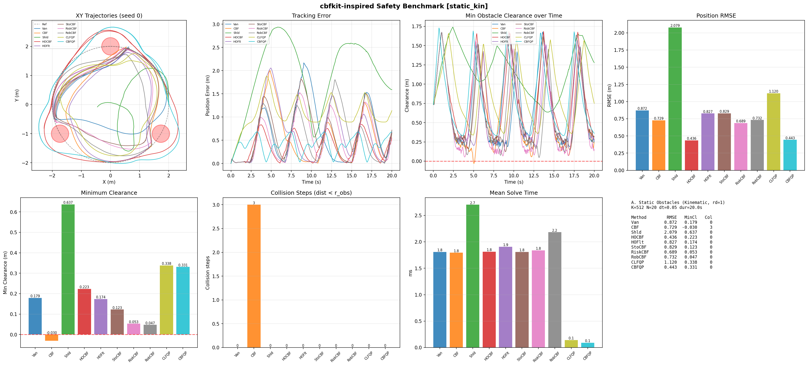
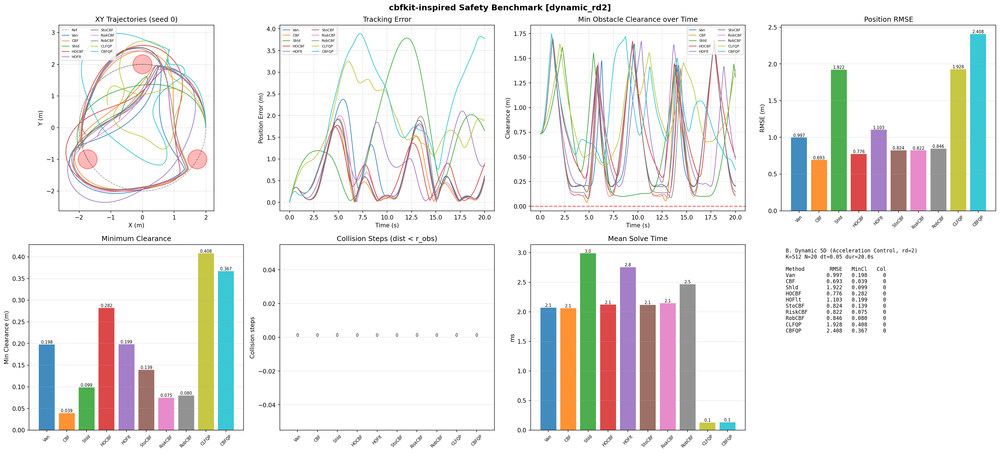
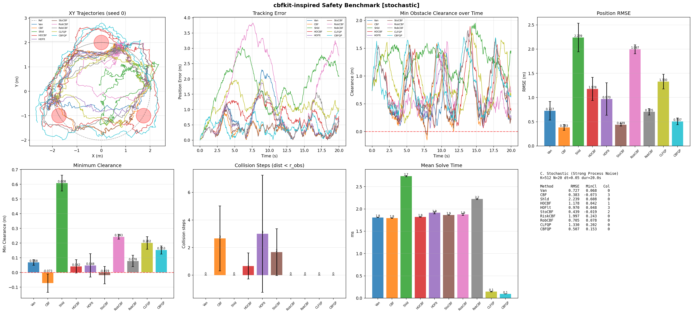
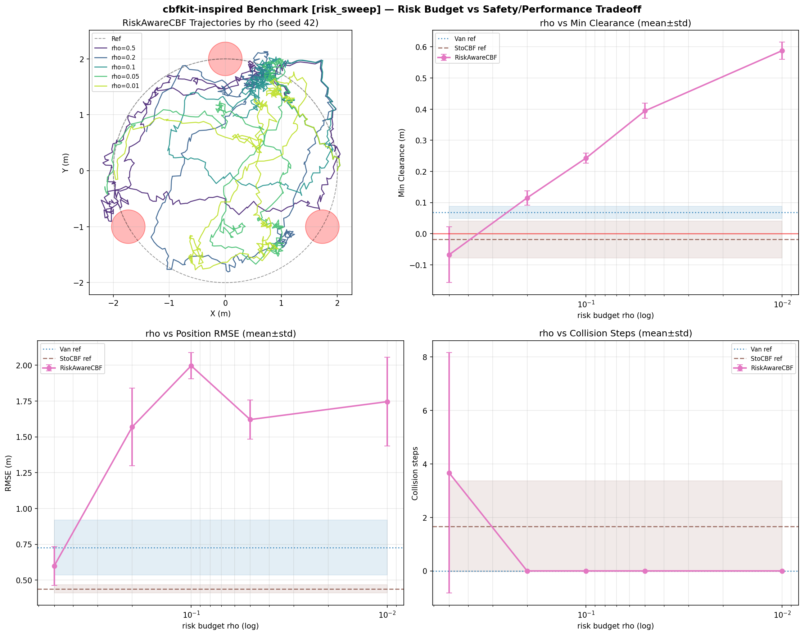

# cbfkit-Inspired Safety Techniques for MPPI: Port, Theory, and Benchmark

**Date:** 2026-07-11

**Abstract.** We ported five safety techniques from [cbfkit](https://github.com/bardhh/cbfkit) (Toyota Research Institute's JAX-based Control Barrier Function toolbox, arXiv:2404.07158) to this pure-numpy MPPI codebase: (1) high-order CBFs (HOCBF, exponential form) as both an MPPI cost and an analytic safety filter, (2) stochastic CBFs with Itô correction, (3) risk-aware path-integral CBFs with a probabilistic safety guarantee P(min_t h < 0) ≤ ρ, (4) robust CBFs with worst-case bounded-disturbance tightening, and (5) a native CLF-CBF-QP controller with analytic fast paths. We benchmarked 10 methods across 4 scenarios (static kinematic, relative-degree-2 dynamic, strong process noise with 3 seeds, and a risk-budget sweep). Headline results: HOCBF-MPPI achieves the best clearance on the relative-degree-2 system (0.282 m vs 0.039–0.199 m for first-order CBF variants) and the best tracking on the static scenario (RMSE 0.436 m); the plain discrete CBF cost collides under strong noise in all 3 seeds while the risk-aware (ρ ≤ 0.2) and robust variants stay collision-free; and the risk budget ρ produces a clean monotone safety dial (min clearance −0.068 → 0.588 m as ρ goes 0.5 → 0.01). The QP controllers solve in ~0.1 ms (≈20× faster than MPPI) and are always collision-free, at the cost of degraded tracking on the 5D model. We also document an honest negative-adjacent finding: for convex circular barriers the Itô correction *relaxes* the CBF condition, so stochastic conservativeness must come from the risk-aware or robust variants instead.

---

## 1. Background

### 1.1 What cbfkit provides

cbfkit (Black, Ubellacker, et al., arXiv:2404.07158) is a JAX-based toolbox for safety-critical control. Its relevant machinery:

- **Certificate rectifiers** (`certificates/rectifiers.py`): automatic rectification of barriers with relative degree ≥ 2 via exponential HOCBF cascades, with sampling-based relative-degree detection.
- **Stochastic CBFs** (`generate_constraints/stochastic_cbfs.py`): generator-based barrier conditions for SDE dynamics dx = (f + gu)dt + σ dw, including the Itô second-order term.
- **Risk-aware path-integral barriers** (`path_integral_barrier.py`): time-dependent margins that bound the probability of barrier violation over a whole trajectory (Black et al., CDC 2023).
- **Robust CBFs** (`robust_cbfs.py`, `utils/robustness_terms.py`): worst-case tightening for bounded disturbances.
- **CLF-CBF-QP control laws** (`cbf_clf_qp_generator`): min-norm QP with hard zeroing-CBF constraints and a relaxable CLF constraint, solved with jaxopt/OSQP.

### 1.2 What this codebase already had

The repo already contained 22 safety-control techniques for MPPI, organized in three families:

- **CBF-as-cost**: `ControlBarrierCost` (discrete zeroing CBF penalty), `ObstacleCost` (soft distance penalty), DBaS (discrete barrier states), and variants.
- **Shield**: `ShieldMPPIController` — per-rollout-step analytic CBF clipping of sampled controls.
- **Post-filters**: analytic CBF filters applied after the MPPI solve (safe_control CBF-QP baselines, conformal-CBF, etc.).

### 1.3 Identified gaps

1. **Relative degree ≥ 2.** All existing barrier costs assumed the barrier's first difference responds to control. On the 5D dynamic model (control = accelerations `[a, α]`), position barriers have relative degree 2: ∇h·g(x) = 0, so a first-order CBF condition constrains nothing the control can directly affect within one step.
2. **Principled stochastic guarantees.** Existing noise handling was heuristic (extra margins, tube MPC). Nothing offered a stated probabilistic bound like P(min_t h < 0) ≤ ρ.
3. **Native QP baseline.** There was no standalone CLF-CBF-QP controller conforming to the repo's `compute_control(state, ref) -> (control, info)` interface for head-to-head comparison against sampling-based safety.

---

## 2. Theory and Integration Points

All barriers below are circular-obstacle barriers h(x) = ‖p − p_o‖² − (r + margin)², evaluated on MPPI sample trajectories of shape (K, N+1, nx).

### 2.1 High-Order CBF (exponential form) — `hocbf_cost.py`

**References:** Ames et al., "Control Barrier Functions: Theory and Applications" (ECC 2019 survey); Xiao & Belta, "Control Barrier Functions for Systems with High Relative Degree" (CDC 2019); cbfkit `certificates/rectifiers.py`.

Continuous-time exponential cascade for relative degree 2:

$$\psi_0(x) = h(x), \qquad \psi_1(x) = \dot\psi_0(x) + \lambda_1 \psi_0(x), \qquad \text{constraint: } \dot\psi_1(x) + \lambda_2 \psi_1(x) \ge 0$$

**`HOCBFCost` (MPPI cost).** On discrete sampled trajectories the cascade uses finite differences:

$$\psi_{1,t} = \frac{\psi_{0,t+1} - \psi_{0,t}}{\Delta t} + \lambda_1 \psi_{0,t} \quad (K, N), \qquad C_t = \frac{\psi_{1,t+1} - \psi_{1,t}}{\Delta t} + \lambda_2 \psi_{1,t} \ge 0 \quad (K, N-1)$$

with penalty cost = weight · Σ_t max(0, −C_t)² (squared, default) or linear. With `relative_degree=1` it reduces exactly to the existing `ControlBarrierCost`: setting λ₁ = α/Δt and weight′ = weight·Δt reproduces `ControlBarrierCost(alpha=α, weight=weight)` (verified in tests).

**`HOCBFFilter` (analytic post-filter).** Control-affine single-constraint filter: with ψ₁ = ∇h·f + λ₁h (drift-only, since ḣ is control-independent at rd = 2), the constraint ∇ψ₁·(f + gu) + λ₂ψ₁ ≥ 0 is affine in u: aᵀu + b ≥ 0 with a = ∇ψ₁·g, b = ∇ψ₁·f + λ₂ψ₁. Violations get the closed-form minimum-norm correction

$$u^* = u_{\text{nom}} + \max(0, -(b + a^\top u_{\text{nom}})) \cdot \frac{a}{a^\top a + \epsilon}$$

then clipping to control bounds; the worst-violated obstacle constraint is applied for `n_passes` iterations. Jacobians via finite differences (exact for control-affine models).

**`detect_relative_degree`** ports cbfkit's sampling approach: evaluate the total control authority Σ|∇h·g_j(x)| over random states; below tolerance → rd = 2.

**Plugs into MPPI as:** trajectory cost (`HOCBFCost`) or post-solve filter (`HOCBFFilter`).

### 2.2 Stochastic CBF (Itô correction) — `stochastic_cbf.py`

**References:** Clark, "Control Barrier Functions for Complete and Incomplete Information Stochastic Systems" (Automatica 2021); see also Black et al. (LCSS 2023) for the stochastic-CBF line used in cbfkit; cbfkit `stochastic_cbfs.py`.

For SDE dynamics dx = (f(x) + g(x)u)dt + σ(x)dw, the infinitesimal generator adds a second-order Itô term to the barrier drift condition:

$$\mathcal{A}h(x) = \nabla h \cdot (f + gu) + \tfrac{1}{2}\mathrm{Tr}[\sigma^\top \nabla^2 h\, \sigma] \ge -\alpha h + \beta$$

For the circular barrier the position-block Hessian is ∇²h = 2I, so the Itô term is **analytic**: ½·Tr[σᵀ(2I)σ] = Σᵢ σ²_pos,i — no autodiff needed. The discrete constraint per sample step is Δh_t/Δt + αh_t + ito − β ≥ 0, penalized linearly.

**Honest caveat (documented in the module):** for convex barriers ∇²h ⪰ 0, so the Itô term is *positive* — isotropic noise increases expected squared distance and therefore **relaxes** the constraint. This is mathematically faithful to cbfkit, but it means conservativeness under noise must come from the buffer β > 0 or from the RiskAware/Robust variants below. Section 7 confirms this empirically.

**Plugs into MPPI as:** trajectory cost.

### 2.3 Risk-Aware path-integral CBF — `stochastic_cbf.py`

**Reference:** Black, Fainekos, Hoxha, Prokhorov, Panagou, "Safety Under Uncertainty: Tight Bounds with Risk-Aware Control Barrier Functions" (CDC 2023); cbfkit `path_integral_barrier.py`.

To guarantee P(min_t h(x_t) < 0) ≤ ρ over the whole horizon, require a time-growing margin:

$$h(x_t) \ge \text{margin}(t) = \sqrt{2t}\,\eta\,\mathrm{erfinv}(1 - 2\rho)$$

derived from the reflection bound on the Brownian martingale M_t = ∫∇h·σ dw with quadratic variation ⟨M⟩_t ≤ η²t. Here η is an upper bound on ‖∇h·σ‖ over the constraint set; the implementation approximates it as the max over the current batch of sampled trajectories (valid on the visited region; a global bound can be supplied via `grad_bound`). ρ = 0.5 gives zero margin (erfinv(0) = 0); ρ → 0 gives margin → ∞. Cost = weight · Σ_t max(0, margin(t) − h(x_t)).

**Plugs into MPPI as:** trajectory cost with a single interpretable knob ρ.

### 2.4 Robust CBF (bounded disturbance) — `robust_cbf_margin.py`

**Reference:** Jankovic, "Robust control barrier functions for constrained stabilization of nonlinear systems" (Automatica 2018; early version 2014); cbfkit `robust_cbfs.py`, `robustness_terms.py`.

For ẋ = f + gu + Mw with ‖w‖ ≤ w_max, tighten the CBF condition by the worst-case disturbance drift:

$$\dot h + \alpha(h) - \|\nabla h \cdot M\| \, w_{\max} \ge 0$$

Discrete form (reusing the existing discrete CBF condition): h_{t+1} − (1 − α)h_t − Δt·‖∇h_t·M‖·w_max ≥ 0. Norm options: 2-norm (‖w‖₂-bounded) or sup (1-norm dual, ‖w‖∞-bounded). w_max = 0 reduces exactly to vanilla `ControlBarrierCost`; the margin is linear in w_max.

**Plugs into MPPI as:** trajectory cost.

### 2.5 CLF-CBF-QP — `clf_cbf_qp.py`

**References:** Ames, Xu, Grizzle, Tabuada, "Control Barrier Function Based Quadratic Programs for Safety Critical Systems" (IEEE TAC 2017; ACC 2017 line); Ames et al. (ECC 2019 survey); cbfkit `cbf_clf_qp_generator` / `vanilla_cbf_clf_qp_control_laws`.

$$\min_{u,\delta} \|u - u_{\text{nom}}\|_P^2 + \lambda_{\text{clf}}\delta^2 \quad \text{s.t.} \quad A_{\text{cbf}} u \ge b_{\text{cbf}} \;(\text{hard}), \quad a_{\text{clf}} u \le b_{\text{clf}} + \delta \;(\text{soft}), \quad u \in [u_{\min}, u_{\max}], \; \delta \ge 0$$

matching cbfkit's `relaxable_clf=True, relaxable_cbf=False` configuration. Instead of jaxopt/OSQP, `CBFCLFQPSolver` uses analytic fast paths with SLSQP fallback (Section 3).

`CLFCBFQPController` (standalone, repo interface):
- **Kinematic 3D** (u = [v, ω]): near-identity look-ahead point p̃ = p + d·[cos θ, sin θ] gives an invertible input map ṗ̃ = M(θ)u; CLF V = ½|p̃ − p_ref|² + k_θe_θ²; CBF h = |p̃ − p_o|² − (r + d + margin)².
- **Dynamic 5D** (u = [a, α]): one-stage HOCBF cascade h_e = ḣ + λh (u appears in ḧ) plus a velocity-error CLF V = ½|w − w_d|² (backstepping-lite, ẇ_d ≈ 0).

`CBFOnlyQPController` drops the CLF (pure-pursuit nominal + hard CBF-QP filter) as the closest analogue of the existing safe_control CBF-QP baseline.

**Plugs into MPPI as:** it doesn't — a standalone optimization-based baseline against which sampling-based safety is compared.

---

## 3. Implementation Notes

- **Discrete-time cascades.** All continuous conditions are transcribed with finite differences on rolled-out sample trajectories; the HOCBF rd=2 cascade needs ≥ 3 timesteps and falls back to rd=1 below that. The exact reduction identities (HOCBF→ControlBarrierCost, StochasticCBF(σ=0,β=0)→ControlBarrierCost, RobustCBF(w_max=0)→ControlBarrierCost) are unit-tested.
- **Batch vectorization.** Every cost is fully vectorized over (K, N+1) with no Python loop over samples — only a short loop over obstacles. Added cost overhead vs vanilla CBF cost is negligible (1.8–2.5 ms total solve time at K=512, N=20).
- **Analytic Hessian.** The circular barrier's position Hessian is 2I, so the Itô trace and the risk-margin gradient bound η = max‖∇h·σ_pos‖ are closed-form; cbfkit's JAX autodiff was not needed anywhere.
- **The Itô term relaxes convex barriers.** Faithful port of the math shows 0.5·Tr[σᵀ∇²hσ] > 0 for h convex, i.e. the stochastic-CBF condition is *weaker* than the deterministic one. This is documented in the module docstring and empirically confirmed (Section 7): under noise, StochasticCBF-MPPI still incurred 1.7 collision steps on average. Conservativeness comes from β > 0, RiskAwareCBFCost, or RobustCBFCost.
- **Seeded-sampler reproducibility fix.** The default `GaussianSampler(sigma, seed=None)` draws its seed from OS entropy, which made benchmark runs unrepeatable. The benchmark constructs every controller with an explicit `GaussianSampler(sigma, seed=seed)`, making all single-seed numbers exactly reproducible.
- **QP analytic fast paths.** The solver tries (a) constraint-inactive clip, (b) closed-form soft-CLF tradeoff u* = u_nom − (λs/(1 + λaᵀP⁻¹a))P⁻¹a, and (c) single-active-CBF equality projection u* = u_nom + P⁻¹gᵀ(c − g·u_nom)/(gP⁻¹gᵀ), falling back to scipy SLSQP only when multiple constraints or bounds are simultaneously active. Result: ~0.09–0.15 ms mean solve time, no external QP dependency.
- **Deadlock avoidance.** The QP controllers' nominal control includes an obstacle-aware tangential projection with hysteresis to prevent head-on stalls; safety is still enforced solely by the hard CBF constraints.
- **Tests:** `tests/test_cbfkit_inspired.py` (42) + `tests/test_clf_cbf_qp.py` (25) = 67 tests covering reduction identities, margin monotonicity in ρ/w_max/σ, filter correction behavior, QP fast-path-vs-SLSQP agreement, and full closed-loop safety runs.

---

## 4. Benchmark Setup

Script: `examples/comparison/cbfkit_inspired_benchmark.py`. Circle reference r = 2.0 m (v_ref = 1.0 m/s), three r = 0.3 m obstacles placed **on** the path at 90°/210°/330°. Common parameters, deliberately **not** tuned per method: K = 512, N = 20, dt = 0.05, λ = 1.0, CBF α = 0.3, barrier weight = 1000, safety margin = 0.1.

| Scenario | Model | Noise | Seeds | Purpose |
|---|---|---|---|---|
| A. static_kin | kinematic 3D (rd=1) | none | 1 | Baseline: everything should work |
| B. dynamic_rd2 | dynamic 5D, accel control (rd=2) | none | 1 | HOCBF home ground |
| C. stochastic | kinematic 3D | per-step std [0.05, 0.05, 0.02] | 3 | Stochastic/robust guarantees |
| D. risk_sweep | kinematic 3D | same as C | 3 | RiskAware ρ ∈ {0.5, 0.2, 0.1, 0.05, 0.01} |

10 methods: Vanilla (ObstacleCost), CBF-MPPI (`ControlBarrierCost`), Shield-MPPI, HOCBF-MPPI, HOCBF-Filter (Vanilla + `HOCBFFilter` post-filter), StochasticCBF-MPPI, RiskAwareCBF-MPPI (ρ=0.1), RobustCBF-MPPI, CLF-CBF-QP, CBF-QP. Metrics: position RMSE, min clearance (dist − r_obs, no margin), collision steps (clearance < 0), mean solve time. Results: `results/cbfkit_inspired/*.json`.

---

## 5. Results

### 5.1 Scenario A — static_kin (kinematic, rd=1, no noise, seed 42)

| Method | RMSE (m) | MinClear (m) | Col | Solve (ms) | ESS | Extra |
|---|---|---|---|---|---|---|
| Vanilla | 0.872 | 0.179 | 0 | 1.8 | 62 | |
| CBF-MPPI | 0.729 | **−0.030** | **3** | 1.8 | 69 | |
| Shield-MPPI | 2.079 | 0.637 | 0 | 2.7 | 1.4 | |
| **HOCBF-MPPI** | **0.436** | 0.223 | 0 | 1.8 | 25 | |
| HOCBF-Filter | 0.827 | 0.174 | 0 | 1.9 | 56 | filt=37% |
| StochasticCBF-MPPI | 0.829 | 0.123 | 0 | 1.8 | 34 | |
| RiskAwareCBF-MPPI | 0.689 | 0.053 | 0 | 1.8 | 50 | |
| RobustCBF-MPPI | 0.732 | 0.047 | 0 | 2.2 | 45 | |
| CLF-CBF-QP | 1.120 | 0.338 | 0 | **0.14** | – | feas=100% |
| CBF-QP | 0.444 | 0.331 | 0 | **0.09** | – | feas=100% |

Even in the deterministic rd=1 case, plain CBF-MPPI grazes an obstacle (min clearance −0.030 m, 3 collision steps) because the soft penalty trades off against tracking; HOCBF-MPPI's squared second-order penalty shapes an earlier, smoother avoidance (best RMSE 0.436 *and* healthy clearance 0.223).

### 5.2 Scenario B — dynamic_rd2 (5D acceleration control, seed 42)

| Method | RMSE (m) | MinClear (m) | Col | Solve (ms) | ESS | Extra |
|---|---|---|---|---|---|---|
| Vanilla | 0.997 | 0.198 | 0 | 2.1 | 64 | |
| CBF-MPPI | 0.693 | 0.039 | 0 | 2.1 | 98 | |
| Shield-MPPI | 1.922 | 0.099 | 0 | 3.0 | 12 | |
| **HOCBF-MPPI** | 0.776 | **0.282** | 0 | 2.1 | 20 | |
| HOCBF-Filter | 1.103 | 0.199 | 0 | 2.8 | 37 | filt=67% |
| StochasticCBF-MPPI | 0.824 | 0.139 | 0 | 2.1 | 83 | |
| RiskAwareCBF-MPPI | 0.822 | 0.075 | 0 | 2.2 | 88 | |
| RobustCBF-MPPI | 0.846 | 0.080 | 0 | 2.5 | 82 | |
| CLF-CBF-QP | 1.928 | 0.408 | 0 | 0.13 | – | feas=100% |
| CBF-QP | 2.408 | 0.367 | 0 | 0.13 | – | feas=99.8% |

HOCBF's home ground: first-order CBF variants only manage 0.039–0.199 m clearance because the barrier's first difference barely responds to acceleration inputs, while the second-order cascade yields 0.282 m at competitive RMSE. The QP controllers stay very safe (0.37–0.41 m) but the backstepping-lite CLF tracks poorly on 5D (RMSE 1.93–2.41).

### 5.3 Scenario C — stochastic (process noise, 3 seeds, mean±std)

| Method | RMSE (m) | MinClear (m) | Col | Solve (ms) |
|---|---|---|---|---|
| Vanilla | 0.727±0.192 | 0.068±0.020 | 0.0 | 1.8 |
| CBF-MPPI | 0.383±0.058 | **−0.073±0.062** | **2.7±2.4 (3/3 seeds)** | 1.8 |
| Shield-MPPI | 2.239±0.294 | 0.608±0.054 | 0.0 | 2.7 |
| HOCBF-MPPI | 1.178±0.241 | 0.042±0.045 | 0.7±0.9 | 1.8 |
| HOCBF-Filter | 0.970±0.335 | 0.048±0.079 | 3.0±4.2 | 1.9 |
| StochasticCBF-MPPI | 0.439±0.030 | −0.019±0.059 | 1.7±1.7 | 1.9 |
| RiskAwareCBF-MPPI (ρ=0.1) | 1.997±0.092 | **0.243±0.016** | **0.0** | 1.9 |
| RobustCBF-MPPI | 0.705±0.066 | 0.078±0.039 | **0.0** | 2.2 |
| CLF-CBF-QP | 1.330±0.152 | 0.202±0.043 | 0.0 | 0.15 |
| CBF-QP | 0.507±0.070 | 0.153±0.028 | 0.0 | 0.09 |

Under noise, the deterministic CBF cost collides in **every** seed; StochasticCBF (Itô, β=0.5) also dips below zero — confirming the relaxation analysis. Only the methods with explicit uncertainty margins (RiskAware, Robust) plus the ultra-conservative Shield and the QP controllers remain collision-free. RobustCBF gives the best safety-per-tracking tradeoff here (RMSE 0.705, clearance 0.078, zero collisions).

### 5.4 Scenario D — risk_sweep (RiskAwareCBF ρ sweep, 3 seeds)

| ρ | RMSE (m) | MinClear (m) | Col |
|---|---|---|---|
| 0.5 (margin = 0) | 0.599±0.135 | −0.068±0.089 | 3.7±4.5 |
| 0.2 | 1.569±0.271 | 0.115±0.023 | 0.0 |
| 0.1 | 1.997±0.092 | 0.243±0.016 | 0.0 |
| 0.05 | 1.621±0.137 | 0.395±0.024 | 0.0 |
| 0.01 | 1.746±0.310 | 0.588±0.028 | 0.0 |
| ref: Vanilla | 0.727±0.192 | 0.068±0.020 | 0.0 |
| ref: StochasticCBF | 0.439±0.030 | −0.019±0.059 | 1.7±1.7 |

Min clearance is monotone in ρ across its full range, so ρ acts as a single interpretable safety dial: ρ = 0.5 recovers the (unsafe) zero-margin CBF, ρ ≤ 0.2 is collision-free in all seeds, and tracking cost is paid mostly between ρ = 0.5 and ρ = 0.1.

---

## 6. Key Findings

- **HOCBF-MPPI dominates on relative-degree-2 dynamics**: min clearance 0.282 m on the 5D acceleration-controlled model vs 0.039–0.199 m for all first-order CBF-cost variants (CBF-MPPI 0.039, RiskAware 0.075, Robust 0.080, StochasticCBF 0.139), and it is also the best tracker on static_kin (RMSE 0.436 m vs 0.729 for CBF-MPPI and 0.872 for Vanilla).
- **Plain discrete CBF-MPPI is unsafe under process noise**: it collided in 3/3 seeds (2.7±2.4 collision steps, min clearance −0.073±0.062 m), while RiskAwareCBF (ρ ≤ 0.2) and RobustCBF stayed collision-free in all seeds — explicit uncertainty margins are what buy stochastic safety, not the barrier form alone.
- **The risk budget ρ is a clean, monotone safety dial**: mean min clearance goes −0.068 → 0.115 → 0.243 → 0.395 → 0.588 m as ρ goes 0.5 → 0.2 → 0.1 → 0.05 → 0.01, matching the theory (ρ = 0.5 ⇒ zero margin; erfinv(1−2ρ) grows as ρ → 0).
- **QP methods are ~20× faster and always safe, but track worse on 5D**: 0.09–0.15 ms mean solve vs 1.8–3.0 ms for MPPI, 100% feasibility (99.8% on 5D CBF-QP), zero collisions everywhere — but the backstepping-lite CLF degrades 5D tracking to RMSE 1.93 (CLF-CBF-QP) and 2.41 (CBF-QP), vs 0.69–0.85 for the MPPI barrier costs.
- **Shield-MPPI is ultra-conservative**: per-step rollout clipping collapses the sampling distribution (ESS ≈ 1.4–1.5 out of 512 on kinematic scenarios) and yields the worst tracking (RMSE 2.08–2.24), though with the largest MPPI-family clearances (0.61–0.64 m).
- **The Itô-relaxation finding is confirmed empirically**: for convex circular barriers the correction term +Σσ²_pos *loosens* the constraint, and StochasticCBF-MPPI accordingly still incurred 1.7±1.7 collision steps under noise despite its β = 0.5 buffer — it tracked best among barrier methods (RMSE 0.439) precisely because it is the least conservative.
- **HOCBF as a post-filter is much weaker than HOCBF as a cost**: HOCBF-Filter engaged on 37–67% of steps but only matched Vanilla clearance (0.174/0.199 m) and became the worst method under noise (3.0±4.2 collision steps), since single-step minimum-norm corrections cannot reshape the whole planned trajectory.
- **All ported costs are essentially free computationally**: HOCBF/Stochastic/RiskAware costs add < 0.1 ms over CBF-MPPI at K = 512, N = 20 (all ≈ 1.8–2.2 ms total); only RobustCBF's per-step gradient-norm margin adds ~0.4 ms.

---

## 7. Recommendations

| Regime | Recommended method | Why |
|---|---|---|
| Deterministic, kinematic (rd=1) | **HOCBF-MPPI** (rd=1 or 2) | Best RMSE (0.436) with solid clearance; CBF-MPPI grazes obstacles even without noise |
| Dynamic / acceleration control (rd=2) | **HOCBF-MPPI (rd=2)** | Only cost formulation whose constraint the control can actually affect; 2–7× clearance of first-order variants |
| Strong process noise, guarantee wanted | **RiskAwareCBF-MPPI, ρ ∈ [0.05, 0.2]** | Collision-free in all seeds with a stated P(violation) ≤ ρ bound; tune ρ to the clearance you need |
| Strong process noise, tracking-sensitive | **RobustCBF-MPPI** (w_max ≈ 1σ step disturbance) | Zero collisions at near-Vanilla RMSE (0.705); cheaper conservativeness than RiskAware |
| Compute-constrained (µs budget, no GPU/sampling) | **CBF-QP** (kinematic) / **CLF-CBF-QP** (dynamic) | ~0.1 ms, always feasible, always safe; accept the 5D tracking penalty or improve the CLF |
| Absolute safety over performance | Shield-MPPI or HOCBFFilter on top of any of the above | Layered defense; expect large conservativeness (Shield) or weak trajectory reshaping (filter) |

A practical layered stack: HOCBF-MPPI (rd matched to the model) or RiskAwareCBF-MPPI as the planning cost, plus the ~0.1 ms `HOCBFFilter` or CBF-QP as a last-resort actuation shield.

---

## 8. Limitations & Future Work

- **η approximation.** RiskAwareCBFCost bounds ‖∇h·σ‖ by its max over the current sample batch, not over the true reachable set; the bound is valid on visited states but the ρ guarantee is approximate whenever the executed trajectory leaves the sampled envelope. A global `grad_bound` restores rigor at the cost of extra conservatism.
- **Circular barriers only.** All costs hard-code h = ‖p − p_o‖² − R² (which is what makes the Hessian/Itô terms analytic). Polytopes, ellipsoids, or learned barriers would need generic ∇h/∇²h plumbing.
- **Single trajectory type.** All four scenarios use one circle reference with three on-path obstacles; figure-8, corridor, and dynamic-obstacle scenes were not swept.
- **Three seeds.** Stochastic and risk-sweep statistics use 3 seeds — enough to expose the CBF-vs-RiskAware gap (which is large), not enough for tight confidence intervals on RMSE.
- **No adaptive-CVaR port.** cbfkit's adaptive risk allocation (and this repo's own ASR-MPPI-style distortions) were not combined with the path-integral margin; an adaptive-ρ RiskAwareCBF is a natural follow-up.
- **No estimator in the loop.** cbfkit couples its stochastic CBFs with EKF/UKF state estimators; here the controller sees the true (noisy) state. Belief-space margins (σ from the estimator covariance) are future work.
- **5D CLF quality.** The backstepping-lite CLF ignores ẇ_d, which explains the 5D tracking gap; a full backstepping or MPC-CLF hybrid would make the QP baseline more competitive.

---

## Appendix: File Map

| Artifact | Path |
|---|---|
| HOCBF cost + filter + rd detection | `mppi_controller/controllers/mppi/hocbf_cost.py` |
| Stochastic + Risk-Aware CBF costs | `mppi_controller/controllers/mppi/stochastic_cbf.py` |
| Robust CBF cost | `mppi_controller/controllers/mppi/robust_cbf_margin.py` |
| CLF-CBF-QP solver + controllers | `mppi_controller/controllers/mppi/clf_cbf_qp.py` |
| Benchmark script | `examples/comparison/cbfkit_inspired_benchmark.py` |
| Result JSONs | `results/cbfkit_inspired/{static_kin,dynamic_rd2,stochastic,risk_sweep}.json` |
| Plots | `plots/cbfkit_inspired_benchmark_{static_kin,dynamic_rd2,stochastic,risk_sweep}.png` |
| Tests (42 + 25) | `tests/test_cbfkit_inspired.py`, `tests/test_clf_cbf_qp.py` |
