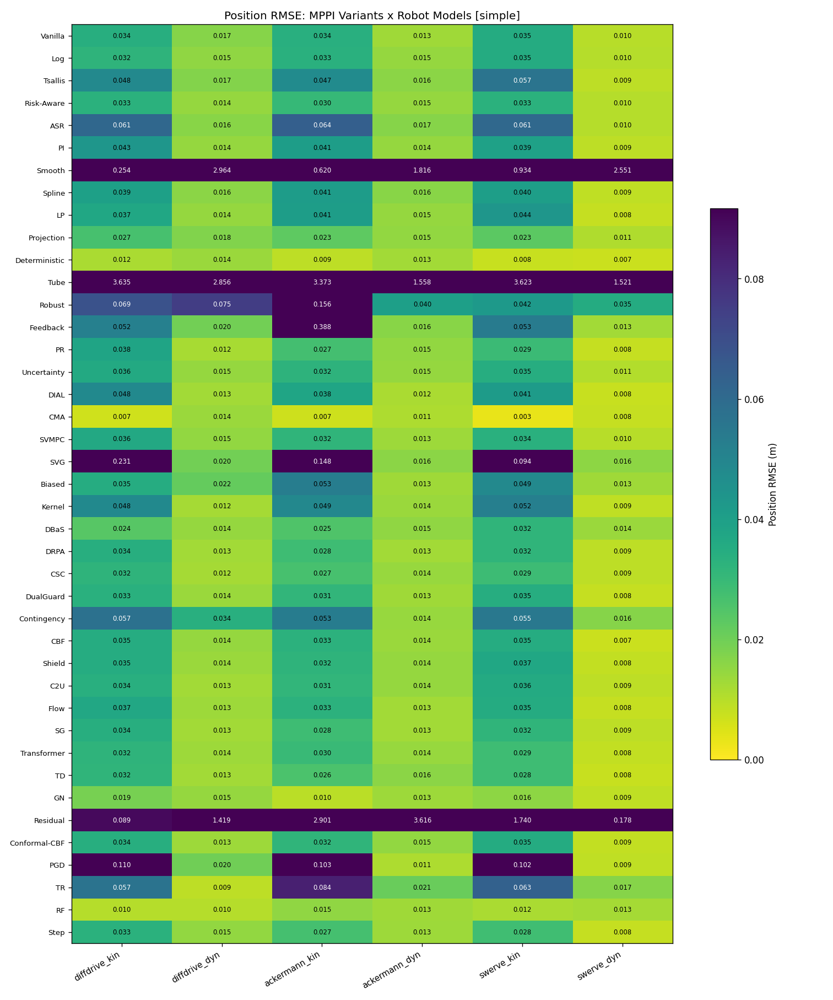
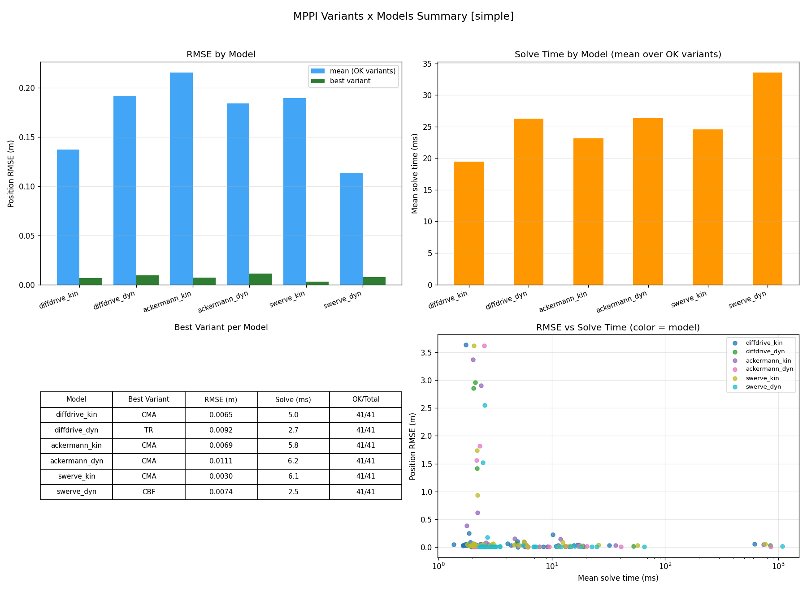
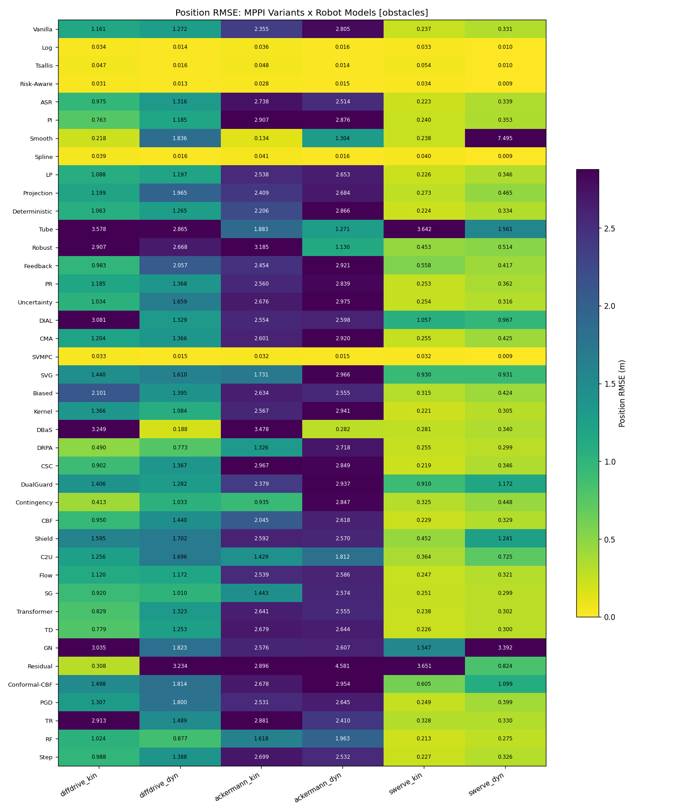
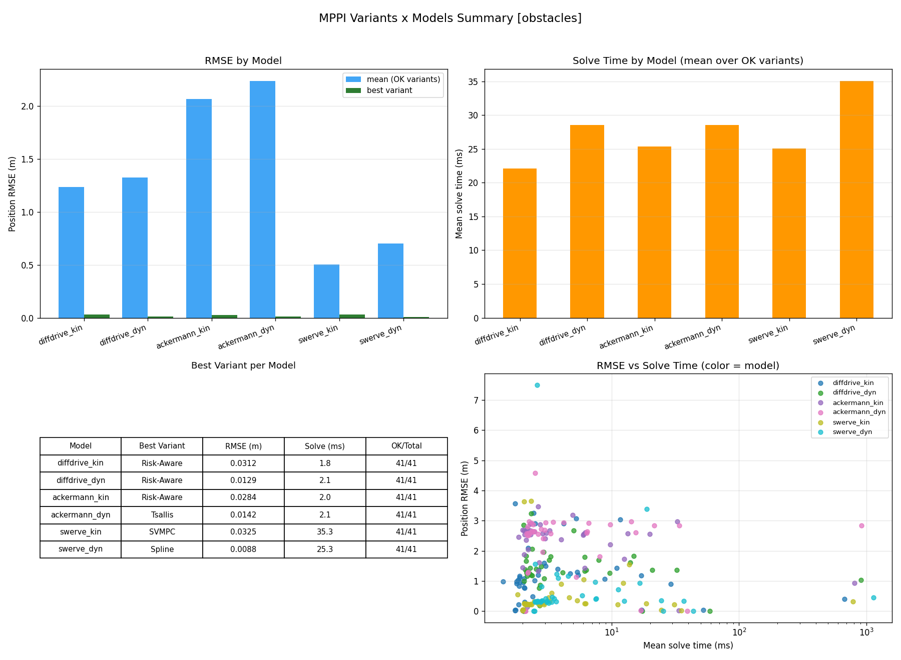

# MPPI Variants × Robot Models: Comparative Evaluation Report

**Date:** 2026-07-11
**Data:** `results/variants_x_models/` (12 JSON files, 41 variants × 6 models × 2 scenarios = 492 cells, all `status=ok`)
**Benchmark script:** `examples/comparison/variants_x_models_benchmark.py`

---

## Key Findings

- **No single winner across models.** CMA-MPPI is the best tracker on the simple scenario (mean RMSE **0.0082 m**, rank 1 on 4 of 6 models) but drops to rank 17 on `diffdrive_dyn`; RF-MPPI (42nd variant, Hermite spline) is the most consistent all-rounder — mean rank 8.7 on simple and the best mean rank (**3.8/31**) among collision-free variants on obstacles, at only ~2.8 ms per solve.
- **On the obstacles scenario, raw RMSE is anti-correlated with safety.** The five lowest-RMSE variants (Risk-Aware, SVMPC, Log, Spline, Tsallis; RMSE 0.01–0.05 m) simply drove *through* the obstacles (220–225 collision events each, min clearance ≈ **−0.34 m** = obstacle center). Because the 3 obstacles sit directly on the reference circle, every controller that actually avoided them paid RMSE ≈ 1–3 m. RMSE must be read jointly with collisions in this scenario.
- **31 of 41 variants achieved zero collisions on all 6 models.** The Safety group (E) genuinely earns its name on clearance: mean min-clearance **0.264 m vs 0.073 m** for all other groups; DualGuard (mean 0.642 m) and C2U (0.533 m) keep by far the largest margins. Group G (ICRA/IROS 2026) is the only group with **zero collisions across all 4 of its variants**.
- **Dynamic (acceleration-level) models were *easier*, not harder, for most variants:** the typical dyn/kin RMSE ratio on simple is ≈ 0.35 (velocity-augmented references + integrator smoothing help). The exceptions collapse hard: Smooth-MPPI degrades **4.5× geomean** (11.7× on diffdrive, 31× on swerve-dyn obstacles) with ESS collapsing to ~1.3/512, and CMA degrades 2.1×.
- **Real-time budget (<100 ms) is met by 40/41 variants** (worst non-violator: SVMPC at ~44–59 ms). The only violator is Contingency-MPPI: **616–1136 ms** per solve (6–11× over budget) due to its nested inner-MPPI checkpoint evaluations.
- **Speed/accuracy Pareto (simple, mean over 6 models):** DBaS (1.97 ms / 0.0207) → Step (2.01 ms / 0.0207) → TD (2.28 ms / 0.0204) → RF (2.74 ms / 0.0121) → CMA (6.03 ms / 0.0082). On obstacles, restricted to zero-collision variants, the front is just **SG (2.09 ms / 1.083)** and **DRPA (2.71 ms / 0.977)**.
- **The smoothness group splits in two.** Projection-MPPI and LP-MPPI hold their advantage on *every* model in the simple scenario (control-rate ranks 1–2 and 3–5; 4–12× smoother than the 0.159 fleet average), and Spline is the smoothest collision-free-adjacent variant under obstacles. But Smooth-MPPI is the *worst-RMSE* smoothness variant on all 6 models (mean RMSE 1.52 m on simple) — its ΔU-lifted parameterization does not transfer to acceleration-level control.
- **Notable anomalies:** Tube-MPPI is last or second-to-last on all 6 models on simple (RMSE 1.5–3.6 m) even after the ancillary-gain dimension fix, indicating its fixed feedback gains fight the MPPI solution; Residual-MPPI (zero-init prior) is wildly model-dependent (RMSE 0.089 → 3.62 across models, and the only Learning-group variant with collisions); Feedback-MPPI shows an 11×-median RMSE spike (0.388 m) on `ackermann_kin` only.

---

## 1. Benchmark Setup

### Robot models

| Key | Model | State | Control | σ (noise) | Q |
|---|---|---|---|---|---|
| `diffdrive_kin` | DifferentialDriveKinematic | 3D `[x, y, θ]` | 2D `[v, ω]` | [0.5, 0.5] | [10, 10, 1] |
| `diffdrive_dyn` | DifferentialDriveDynamic | 5D `[x, y, θ, v, ω]` | 2D `[a, α]` | [1.0, 1.0] | [10, 10, 1, 0.5, 0.5] |
| `ackermann_kin` | AckermannKinematic | 4D `[x, y, θ, δ]` | 2D `[v, φ]` | [0.5, 0.5] | [10, 10, 1, 0.1] |
| `ackermann_dyn` | AckermannDynamic | 5D `[x, y, θ, v, δ]` | 2D `[a, φ]` | [1.0, 0.5] | [10, 10, 1, 0.5, 0.1] |
| `swerve_kin` | SwerveDriveKinematic | 3D `[x, y, θ]` | 3D `[vx, vy, ω]` | [0.5, 0.5, 0.5] | [10, 10, 1] |
| `swerve_dyn` | SwerveDriveDynamic | 6D `[x, y, θ, vx, vy, ω]` | 3D `[ax, ay, α]` | [1.0, 1.0, 1.0] | [10, 10, 1, 0.5, 0.5, 0.5] |

All models: `v_max = ω_max = 2.0`, Ackermann wheelbase `L = 0.5`, `max_steer = 0.6`.

### Scenarios and common parameters

- **Trajectory:** circle, radius 2.0 m, angular velocity 0.5 rad/s (tangential speed 1.0 m/s), duration 10 s → 200 control steps.
- **Common MPPI params:** `K = 512`, `N = 20`, `dt = 0.05`, `λ = 1.0`, `R = 0.1·I`, seed 42.
- **`simple`:** no obstacles.
- **`obstacles`:** 3 circular obstacles (r = 0.35 m) placed *on the reference circle* at 45°, 165°, 285°. `collisions` counts timestep–obstacle penetration events (clearance < 0) over the 200-step run; `min_clearance` is the worst clearance observed.

### Dimension adaptation

- **References:** the base 3D pose circle is extended per model — `diffdrive_dyn` appends `[v_ref = rω = 1.0, ω_ref = 0.5]`; `ackermann_kin` appends `δ_ref = atan(L/r)`; `ackermann_dyn` appends `[v_ref, δ_ref]`; `swerve_dyn` appends body-frame `[vx = 1.0, vy = 0, ω = 0.5]`. Q/σ are per-model (table above); costs are built with model-appropriate state weights via the shared cost factory from `all_37_variants_benchmark`.
- **Variant-specific overrides** (`adapt_variant_for_model`): Tube's `K_fb = 2·I(nu, nx)`; Robust's `disturbance_std` is per-state-dim (0.05 on pose, 0.02 elsewhere); PR's wheelbase belief is centered on the model's nominal with ±40% bounds.
- **Tube/Robust ancillary-gain dimension fix:** the default `AncillaryController` assumes diffdrive dimensions (kin 3×2 / dyn 5×2). For all non-diffdrive-shaped models, Tube-MPPI and Robust-MPPI are explicitly constructed with a general `AncillaryController(K_fb = I(nu, nx), max_correction = 0.5·1)`. Without this fix these variants raise dimension errors; with it, all 492 cells run to completion.
- Learning-based variants (F group: Flow, SG, Transformer, TD, GN, Residual) run in **zero-init / untrained mode** — no pre-training was performed, so they reflect the graceful-degradation path of each method, not their trained potential.

### Result plots

**Simple scenario:**

**Obstacles scenario:**

---

## 2. Per-Model Rankings (top-5 by position RMSE)

### Simple scenario (RMSE m / mean solve ms)

| Model | #1 | #2 | #3 | #4 | #5 |
|---|---|---|---|---|---|
| diffdrive_kin | CMA 0.0065/5.0 | RF 0.0101/2.3 | Deterministic 0.0116/8.5 | GN 0.0190/10.9 | DBaS 0.0238/1.6 |
| diffdrive_dyn | TR 0.0092/2.7 | RF 0.0102/2.6 | PR 0.0120/19.1 | Kernel 0.0123/2.8 | CSC 0.0123/11.4 |
| ackermann_kin | CMA 0.0069/5.8 | Deterministic 0.0091/9.2 | GN 0.0096/13.2 | RF 0.0151/2.6 | Projection 0.0227/2.8 |
| ackermann_dyn | CMA 0.0111/6.2 | PGD 0.0112/6.1 | DIAL 0.0115/6.0 | DRPA 0.0128/2.0 | SG 0.0128/2.0 |
| swerve_kin | CMA 0.0030/6.1 | Deterministic 0.0076/11.4 | RF 0.0117/2.7 | GN 0.0156/13.0 | Projection 0.0230/2.8 |
| swerve_dyn | CBF 0.0074/2.5 | Deterministic 0.0075/12.0 | TD 0.0076/2.6 | DIAL 0.0078/6.9 | CMA 0.0079/7.2 |

Takeaways: **CMA** dominates kinematic models; **RF** and **Deterministic** appear in the top-5 of 4–5 models each; optimizer-style variants (TR, PGD, DIAL) shine specifically on dynamic models.

### Obstacles scenario — raw RMSE top-5 is misleading

The raw top-5 on *every* model is drawn from {Risk-Aware, SVMPC, Log, Spline, Tsallis} (RMSE 0.009–0.054) — **all five plow straight through the obstacles** (37–38 collision events per model, min clearance ≈ −0.34 m). Ranking restricted to the 31 zero-collision variants (RMSE m / min clearance m / solve ms):

| Model | #1 | #2 | #3 | #4 | #5 |
|---|---|---|---|---|---|
| diffdrive_kin | Contingency 0.41/0.18/674 | DRPA 0.49/0.19/2.4 | PI 0.76/0.10/2.1 | TD 0.78/0.20/2.0 | Transformer 0.83/0.20/1.9 |
| diffdrive_dyn | DRPA 0.77/0.20/2.7 | RF 0.88/0.20/2.8 | SG 1.01/0.20/2.1 | Contingency 1.03/0.20/902 | Kernel 1.08/0.19/2.9 |
| ackermann_kin | Contingency 0.94/0.13/803 | DRPA 1.33/0.18/2.6 | C2U 1.43/0.39/6.1 | SG 1.44/0.19/2.0 | RF 1.62/0.19/2.7 |
| ackermann_dyn | C2U 1.81/0.71/8.0 | RF 1.96/0.17/2.9 | TR 2.41/0.19/2.9 | ASR 2.51/0.19/2.2 | Step 2.53/0.20/2.2 |
| swerve_kin | RF 0.21/0.21/2.8 | CSC 0.22/0.21/31.1 | Kernel 0.22/0.12/2.9 | ASR 0.22/0.15/2.2 | Deterministic 0.22/0.21/11.1 |
| swerve_dyn | RF 0.28/0.20/3.2 | DRPA 0.30/0.21/3.1 | SG 0.30/0.21/2.5 | TD 0.30/0.20/2.8 | Transformer 0.30/0.20/2.6 |

Note the platform effect: omnidirectional swerve avoids obstacles with a small sidestep (RMSE 0.2–0.3), while Ackermann avoidance costs 1.4–2.5 m RMSE (max position error saturates near 4.0 m ≈ the circle diameter — the robot ends up far off-phase after each detour).

---

## 3. Cross-Model Robustness

Variants ranked 1–41 by RMSE within each model; the table shows mean and worst rank over the 6 models.

### Consistently strong (simple)

| Variant | Grp | Mean rank | Worst rank @ model | Per-model ranks (ddk, ddd, ak, ad, sk, sd) |
|---|---|---:|---|---|
| CMA | D | 4.3 | 17 @ diffdrive_dyn | 1, 17, 1, 1, 1, 5 |
| Deterministic | B | 5.0 | 15 @ diffdrive_dyn | 3, 15, 2, 6, 2, 2 |
| RF | G | 8.7 | 31 @ swerve_dyn | 2, 2, 4, 10, 3, 31 |
| GN | F | 10.7 | 23 @ diffdrive_dyn | 4, 23, 3, 14, 4, 16 |
| TD | F | 10.8 | 31 @ ackermann_dyn | 7, 10, 7, 31, 7, 3 |
| DRPA | E | 11.2 | 20 @ swerve_dyn | 15, 6, 11, 4, 11, 20 |

### Consistently weak (simple, bottom of table)

| Variant | Grp | Mean rank | Worst | Note |
|---|---|---:|---:|---|
| Tube | C | 40.3 | 41 | Last/next-to-last on **all 6** models |
| Smooth | B | 40.0 | 41 | RMSE 0.25–2.96 everywhere; ESS ≈ 1.3–2.9 |
| Residual | F | 39.3 | 41 | Zero-init prior; erratic across models |
| Robust | C | 35.8 | 38 | RMSE 0.035–0.156 (functional but noisy) |
| SVG | D | 35.3 | 39 | Weak on kinematic models in particular |

### Model-specific collapses (good on average, bad somewhere)

| Variant | Scenario | Mean rank | Collapse | Pattern |
|---|---|---:|---|---|
| CMA | simple | 4.3 | 17 @ diffdrive_dyn | Covariance adaptation mis-tunes on 5D diffdrive dynamics |
| RF | simple | 8.7 | 31 @ swerve_dyn | Spline knots vs 3D acceleration control |
| TD | simple | 10.8 | 31 @ ackermann_dyn | Value bootstrap hurts with steering dynamics |
| PGD | simple | 27.2 | ranks 38/35/35/38 on kin vs **2 @ ackermann_dyn** | Preconditioned GD helps only acceleration-level models |
| TR | simple | 29.7 | **rank 1 @ diffdrive_dyn** vs 33–37 elsewhere | Trust-region KL step ideal on diffdrive dynamics only |
| DIAL | simple | 16.0 | 29 @ diffdrive_kin vs 3–8 on dyn | Multi-iteration annealing pays off only on dynamics |
| DBaS | obstacles | 23.3 | ranks 40/41 on diffdrive/ackermann **kin**, rank 6 on their **dyn** versions | Barrier-state augmentation behaves bimodally |
| Smooth | obstacles | 19.2 | 41 @ swerve_dyn (RMSE 7.50) | Worst single cell in the study |
| Residual | obstacles | 33.3 | rank 7 @ diffdrive_kin, 41 elsewhere | Only model where its zero-init prior is adequate |

On obstacles the most robust *collision-free* variants are **RF (mean rank 3.8/31, worst 12)**, **SG (6.8)**, and **DRPA (7.2)**.

---

## 4. Speed/Accuracy Tradeoff

Mean position RMSE vs mean solve time across the 6 models.

### Pareto front — simple

| Variant | Grp | Mean RMSE (m) | Mean solve (ms) |
|---|---|---:|---:|
| DBaS | E | 0.0207 | 1.97 |
| Step | G | 0.0207 | 2.01 |
| TD | F | 0.0204 | 2.28 |
| RF | G | 0.0121 | 2.74 |
| CMA | D | 0.0082 | 6.03 |

(Reference: Vanilla = 0.0239 m / 2.04 ms — the front dominates it at essentially equal cost.)

### Pareto front — obstacles (zero-collision variants only)

| Variant | Grp | Mean RMSE (m) | Mean solve (ms) | Mean min-clearance (m) |
|---|---|---:|---:|---:|
| SG | F | 1.083 | 2.09 | 0.199 |
| DRPA | E | 0.977 | 2.71 | 0.199 |

Close behind: RF (0.995 / 2.79), C2U (1.214 / 7.25, but clearance 0.533), CBF (1.269 / 2.31).

### Real-time compliance (100 ms limit)

- **Violator:** Contingency-MPPI only — 616–1136 ms per solve depending on model (mean 820 ms simple / 869 ms obstacles). Its nested inner-MPPI contingency evaluation is ~2 orders of magnitude above the fleet.
- Slowest compliant variants (mean, simple): SVMPC 47.4 ms, Spline 19.9 ms, PR 19.1 ms, GN 14.0 ms, SVG 12.8 ms, CSC 12.4 ms. Everything else runs at 2–12 ms.

---

## 5. Obstacle Safety

- **Zero collisions on all 6 models: 31/41 variants.** The 10 colliders, by total collision events (timestep–obstacle penetrations, summed over 6 × 200-step runs): Tsallis 225, Log 222, Risk-Aware 222, Spline 220, SVMPC 220, Smooth 131, Tube 109, Robust 60, DBaS 47, Residual 21.
- Note the failure mode split: Tsallis/Log/Risk-Aware/Spline/SVMPC track the reference *through* the obstacles on every model (their weighting concentrates on low-tracking-cost samples and the soft obstacle cost never wins); Tube/Smooth/Robust collide because their trajectories are already erratic; DBaS collides only on dynamic models (20 + 21 + 6 events) while over-avoiding on kinematic ones (RMSE 3.2–3.5); Residual collides only on diffdrive_kin/ackermann_kin.

### Clearance leaders (mean min-clearance over 6 models, all zero-collision)

| Variant | Grp | Worst min-clearance | Mean min-clearance |
|---|---|---:|---:|
| DualGuard | E | 0.418 | 0.642 |
| C2U | E | 0.346 | 0.533 |
| GN | F | 0.208 | 0.299 |
| Conformal-CBF | F | 0.173 | 0.232 |
| DIAL | D | 0.200 | 0.229 |
| Shield | E | 0.186 | 0.228 |

### Does the Safety group (E) actually win?

Yes, on clearance: group E mean min-clearance **0.264 m** vs **0.073 m** for all other variants. Per group (obstacles, 6 models):

| Group | n | Mean min-clr | Worst min-clr | Total collisions |
|---|---:|---:|---:|---:|
| A Foundational | 6 | −0.086 | −0.348 | 669 |
| B Smoothness | 5 | −0.012 | −0.346 | 351 |
| C Robustness | 5 | 0.038 | −0.346 | 169 |
| D Exploration | 6 | 0.109 | −0.342 | 220 |
| **E Safety** | 8 | **0.264** | −0.288 | 47 |
| F Learning | 7 | 0.193 | −0.192 | 21 |
| **G ICRA/IROS 2026** | 4 | 0.200 | **0.171** | **0** |

Caveat within E: DBaS contributes all 47 of the group's collisions; the other 7 safety variants are collision-free. Group G is the only group where *every member* is collision-free (worst-case clearance 0.171 m).

---

## 6. Kinematic vs Dynamic Sensitivity

RMSE ratio (dynamic / kinematic) per platform, geometric mean over diffdrive, ackermann, swerve (simple scenario):

| Variant | dd ratio | ack ratio | swerve ratio | Geomean | Verdict |
|---|---:|---:|---:|---:|---|
| Smooth | **11.67** | 2.93 | 2.73 | **4.54** | Collapses on dynamics |
| CMA | 2.14 | 1.60 | 2.66 | 2.09 | Clearly degrades |
| Residual | **15.91** | 1.25 | 0.10 | 1.27 | Erratic (both directions) |
| Deterministic | 1.18 | 1.41 | 0.98 | 1.18 | Mildly degrades |
| RF | 1.01 | 0.88 | 1.07 | 0.98 | Model-invariant |
| *typical variant* | ~0.4 | ~0.4 | ~0.3 | **~0.35** | **Improves** on dynamics |
| PGD | 0.18 | 0.11 | 0.09 | 0.12 | Far better on dynamics |
| SVG | 0.08 | 0.11 | 0.17 | 0.11 | Far better on dynamics |

The headline result is inverted from the usual expectation: **for ~90% of variants, acceleration-level models track *better*** (ratios 0.2–0.6), because the velocity-augmented reference plus double-integrator smoothing regularizes rollouts, and dynamic models were given larger sampling σ. The algorithms that buck the trend do so for structural reasons: Smooth-MPPI's ΔU lifting stacks a third integration level onto acceleration control (ESS collapses to 1.3–2.9 of 512 samples), and CMA's covariance adaptation overfits the easier kinematic landscape. Under obstacles the same pattern holds directionally (Smooth geomean 13.7×, worst single cell swerve_dyn RMSE = 7.50 m).

---

## 7. Smoothness (control_rate, lower = smoother)

### Simple scenario, mean over 6 models (fleet average 0.159)

| Variant | Grp | Mean control_rate | Per-model smoothness rank | Mean RMSE |
|---|---|---:|---|---:|
| TR | G | **0.0085** | — (smoothest overall) | 0.042 |
| Projection | B | 0.0131 | 1, 2, 1, 2, 2, 2 | 0.019 |
| CMA | D | 0.0381 | — | 0.008 |
| LP | B | 0.0399 | 5, 3, 5, 3, 3, 3 | 0.027 |
| RF | G | 0.0648 | 4, 11, 4, 6, 5, 11 | 0.012 |
| Spline | B | 0.0706 | 6, 10, 6, 5, 8, 10 | 0.027 |
| Smooth | B | 0.3003 | **38, 34, 40, 37, 36, 34** | 1.523 |

**Verdict:** 4 of the 5 smoothness-group variants (Projection, LP, Spline, and RF if counted with them) hold their advantage on every model — Projection is rank 1–2 on all 6 and 12× smoother than the fleet average with *better*-than-Vanilla RMSE. Smooth-MPPI is the outlier: rougher than 80% of the fleet *and* the worst tracker in its group. Notably, the smoothest controller overall is TR-MPPI (group G), whose trust-region step-size limiting acts as implicit smoothing.

Under obstacles the fleet average rises to 0.526; Spline stays rank 1 on 5/6 models (0.071) and Projection rank 1–8 (0.112), but Spline's smoothness there partly reflects that it never swerves (it collides); among zero-collision variants, Projection and LP (0.216) remain the smoothest.

---

## 8. Group-Level Summary (mean over variants × 6 models)

### Simple

| Group | n | RMSE | Median RMSE | Ctrl rate | Solve ms | ESS |
|---|---:|---:|---:|---:|---:|---:|
| A Foundational | 6 | 0.028 | 0.024 | 0.145 | 2.1 | 239 |
| B Smoothness | 5 | 0.321* | 0.020 | 0.100 | 7.4 | 197 |
| C Robustness | 5 | 0.593* | 0.037 | 0.241 | 6.0 | 137 |
| D Exploration | 6 | 0.035 | 0.016 | 0.141 | 12.9 | 167 |
| E Safety | 8 | 0.024 | 0.025 | 0.179 | 106.3** | 179 |
| F Learning | 7 | 0.254* | 0.023 | 0.197 | 3.9 | 201 |
| G ICRA/IROS 2026 | 4 | 0.033 | 0.016 | **0.070** | 3.4 | 227 |

\* Means inflated by a single pathological member (B: Smooth; C: Tube; F: Residual) — compare medians.
\** Mean inflated by Contingency (820 ms); the other 7 safety variants average ~4 ms.

### Obstacles

| Group | n | RMSE | Median RMSE | Ctrl rate | Solve ms | ESS | Min-clr | Collisions |
|---|---:|---:|---:|---:|---:|---:|---:|---:|
| A Foundational | 6 | 0.696 | 0.139 | 0.441 | 2.2 | 134 | −0.086 | 669 |
| B Smoothness | 5 | 1.213 | 0.764 | 0.259 | 7.5 | 53 | −0.012 | 351 |
| C Robustness | 5 | 1.751 | 1.610 | 0.760 | 6.4 | 34 | 0.038 | 169 |
| D Exploration | 6 | 1.334 | 1.266 | 0.421 | 12.6 | 111 | 0.109 | 220 |
| E Safety | 8 | 1.322 | 1.207 | 0.741 | 115.5** | 29 | **0.264** | 47 |
| F Learning | 7 | 1.699 | 1.470 | 0.556 | 4.2 | 91 | 0.193 | 21 |
| G ICRA/IROS 2026 | 4 | 1.392 | 1.347 | 0.366 | 3.5 | 54 | 0.200 | **0** |

Low group-A/B obstacle RMSE reflects their colliding members (see §5), not superior avoidance.

---

## Full RMSE Matrices

<b>Simple scenario — position RMSE (m), 41 variants × 6 models</b>

| Variant | Grp | dd_kin | dd_dyn | ack_kin | ack_dyn | sw_kin | sw_dyn |
|---|---|---:|---:|---:|---:|---:|---:|
| Vanilla | A | 0.034 | 0.017 | 0.034 | 0.013 | 0.035 | 0.010 |
| Log | A | 0.032 | 0.015 | 0.033 | 0.015 | 0.035 | 0.010 |
| Tsallis | A | 0.048 | 0.017 | 0.047 | 0.016 | 0.057 | 0.009 |
| Risk-Aware | A | 0.033 | 0.014 | 0.030 | 0.015 | 0.033 | 0.010 |
| ASR | A | 0.061 | 0.016 | 0.064 | 0.017 | 0.061 | 0.010 |
| PI | A | 0.043 | 0.014 | 0.041 | 0.014 | 0.039 | 0.009 |
| Smooth | B | 0.254 | 2.964 | 0.620 | 1.816 | 0.934 | 2.551 |
| Spline | B | 0.039 | 0.016 | 0.041 | 0.016 | 0.040 | 0.009 |
| LP | B | 0.037 | 0.014 | 0.041 | 0.015 | 0.044 | 0.008 |
| Projection | B | 0.027 | 0.018 | 0.023 | 0.015 | 0.023 | 0.011 |
| Deterministic | B | 0.012 | 0.014 | 0.009 | 0.013 | 0.008 | 0.007 |
| Tube | C | 3.635 | 2.856 | 3.373 | 1.558 | 3.623 | 1.521 |
| Robust | C | 0.069 | 0.075 | 0.156 | 0.040 | 0.042 | 0.035 |
| Feedback | C | 0.052 | 0.020 | 0.388 | 0.016 | 0.053 | 0.013 |
| PR | C | 0.038 | 0.012 | 0.027 | 0.015 | 0.029 | 0.008 |
| Uncertainty | C | 0.036 | 0.015 | 0.032 | 0.015 | 0.035 | 0.011 |
| DIAL | D | 0.048 | 0.013 | 0.038 | 0.012 | 0.041 | 0.008 |
| CMA | D | 0.007 | 0.014 | 0.007 | 0.011 | 0.003 | 0.008 |
| SVMPC | D | 0.036 | 0.015 | 0.032 | 0.013 | 0.034 | 0.010 |
| SVG | D | 0.231 | 0.020 | 0.148 | 0.016 | 0.094 | 0.016 |
| Biased | D | 0.035 | 0.022 | 0.053 | 0.013 | 0.049 | 0.013 |
| Kernel | D | 0.048 | 0.012 | 0.049 | 0.014 | 0.052 | 0.009 |
| DBaS | E | 0.024 | 0.014 | 0.025 | 0.015 | 0.032 | 0.014 |
| DRPA | E | 0.034 | 0.013 | 0.028 | 0.013 | 0.032 | 0.009 |
| CSC | E | 0.032 | 0.012 | 0.027 | 0.014 | 0.029 | 0.009 |
| DualGuard | E | 0.033 | 0.014 | 0.031 | 0.013 | 0.035 | 0.008 |
| Contingency | E | 0.057 | 0.034 | 0.053 | 0.014 | 0.055 | 0.016 |
| CBF | E | 0.035 | 0.014 | 0.033 | 0.014 | 0.035 | 0.007 |
| Shield | E | 0.035 | 0.014 | 0.032 | 0.014 | 0.037 | 0.008 |
| C2U | E | 0.034 | 0.013 | 0.031 | 0.014 | 0.036 | 0.009 |
| Flow | F | 0.037 | 0.013 | 0.033 | 0.013 | 0.035 | 0.008 |
| SG | F | 0.034 | 0.013 | 0.028 | 0.013 | 0.032 | 0.009 |
| Transformer | F | 0.032 | 0.014 | 0.030 | 0.014 | 0.029 | 0.008 |
| TD | F | 0.032 | 0.013 | 0.026 | 0.016 | 0.028 | 0.008 |
| GN | F | 0.019 | 0.015 | 0.010 | 0.013 | 0.016 | 0.009 |
| Residual | F | 0.089 | 1.419 | 2.901 | 3.616 | 1.740 | 0.178 |
| Conformal-CBF | F | 0.034 | 0.013 | 0.032 | 0.015 | 0.035 | 0.009 |
| PGD | G | 0.110 | 0.020 | 0.103 | 0.011 | 0.102 | 0.009 |
| TR | G | 0.057 | 0.009 | 0.084 | 0.021 | 0.063 | 0.017 |
| RF | G | 0.010 | 0.010 | 0.015 | 0.013 | 0.012 | 0.013 |
| Step | G | 0.033 | 0.015 | 0.027 | 0.013 | 0.028 | 0.008 |

<b>Obstacles scenario — position RMSE (m), 41 variants × 6 models</b> (low RMSE with collisions means the variant drove through obstacles — cross-check §5)

| Variant | Grp | dd_kin | dd_dyn | ack_kin | ack_dyn | sw_kin | sw_dyn |
|---|---|---:|---:|---:|---:|---:|---:|
| Vanilla | A | 1.161 | 1.272 | 2.355 | 2.805 | 0.237 | 0.331 |
| Log | A | 0.034 | 0.014 | 0.036 | 0.016 | 0.033 | 0.010 |
| Tsallis | A | 0.047 | 0.016 | 0.048 | 0.014 | 0.054 | 0.010 |
| Risk-Aware | A | 0.031 | 0.013 | 0.028 | 0.015 | 0.034 | 0.009 |
| ASR | A | 0.975 | 1.316 | 2.738 | 2.514 | 0.223 | 0.339 |
| PI | A | 0.763 | 1.185 | 2.907 | 2.876 | 0.240 | 0.353 |
| Smooth | B | 0.218 | 1.836 | 0.134 | 1.304 | 0.238 | 7.495 |
| Spline | B | 0.039 | 0.016 | 0.041 | 0.016 | 0.040 | 0.009 |
| LP | B | 1.088 | 1.197 | 2.538 | 2.653 | 0.226 | 0.346 |
| Projection | B | 1.199 | 1.965 | 2.409 | 2.684 | 0.273 | 0.465 |
| Deterministic | B | 1.063 | 1.265 | 2.206 | 2.866 | 0.224 | 0.334 |
| Tube | C | 3.578 | 2.865 | 1.883 | 1.271 | 3.642 | 1.561 |
| Robust | C | 2.907 | 2.668 | 3.185 | 1.130 | 0.453 | 0.514 |
| Feedback | C | 0.983 | 2.057 | 2.454 | 2.921 | 0.558 | 0.417 |
| PR | C | 1.185 | 1.368 | 2.560 | 2.839 | 0.253 | 0.362 |
| Uncertainty | C | 1.034 | 1.659 | 2.676 | 2.975 | 0.254 | 0.316 |
| DIAL | D | 3.081 | 1.329 | 2.554 | 2.598 | 1.057 | 0.967 |
| CMA | D | 1.204 | 1.366 | 2.601 | 2.920 | 0.255 | 0.425 |
| SVMPC | D | 0.033 | 0.015 | 0.032 | 0.015 | 0.032 | 0.009 |
| SVG | D | 1.440 | 1.610 | 1.731 | 2.966 | 0.930 | 0.931 |
| Biased | D | 2.101 | 1.395 | 2.634 | 2.555 | 0.315 | 0.424 |
| Kernel | D | 1.366 | 1.084 | 2.567 | 2.941 | 0.221 | 0.305 |
| DBaS | E | 3.249 | 0.188 | 3.478 | 0.282 | 0.281 | 0.340 |
| DRPA | E | 0.490 | 0.773 | 1.326 | 2.718 | 0.255 | 0.299 |
| CSC | E | 0.902 | 1.367 | 2.967 | 2.849 | 0.219 | 0.346 |
| DualGuard | E | 1.406 | 1.282 | 2.379 | 2.937 | 0.910 | 1.172 |
| Contingency | E | 0.413 | 1.033 | 0.935 | 2.847 | 0.325 | 0.448 |
| CBF | E | 0.950 | 1.440 | 2.045 | 2.618 | 0.229 | 0.329 |
| Shield | E | 1.595 | 1.702 | 2.592 | 2.570 | 0.452 | 1.241 |
| C2U | E | 1.256 | 1.696 | 1.429 | 1.812 | 0.364 | 0.725 |
| Flow | F | 1.120 | 1.172 | 2.539 | 2.586 | 0.247 | 0.321 |
| SG | F | 0.920 | 1.010 | 1.443 | 2.574 | 0.251 | 0.299 |
| Transformer | F | 0.829 | 1.323 | 2.641 | 2.555 | 0.238 | 0.302 |
| TD | F | 0.779 | 1.253 | 2.679 | 2.644 | 0.226 | 0.300 |
| GN | F | 3.035 | 1.823 | 2.576 | 2.607 | 1.547 | 3.392 |
| Residual | F | 0.308 | 3.234 | 2.896 | 4.581 | 3.651 | 0.824 |
| Conformal-CBF | F | 1.498 | 1.814 | 2.678 | 2.954 | 0.605 | 1.099 |
| PGD | G | 1.307 | 1.800 | 2.531 | 2.645 | 0.249 | 0.399 |
| TR | G | 2.913 | 1.489 | 2.881 | 2.410 | 0.328 | 0.330 |
| RF | G | 1.024 | 0.877 | 1.618 | 1.963 | 0.213 | 0.275 |
| Step | G | 0.988 | 1.388 | 2.699 | 2.532 | 0.227 | 0.326 |

---

## Limitations & Future Work

1. **Single trajectory type and speed.** Only the r = 2.0 m, ω = 0.5 rad/s circle was tested. Figure-8, straight-line, and aggressive-turn references would stress different failure modes (e.g., Ackermann steering saturation, swerve lateral dynamics).
2. **Single seed (42), single run per cell.** Sampling-based controllers have run-to-run variance; rank differences of a few places (especially mid-table) are within noise. Multi-seed replication with confidence intervals is needed before drawing fine-grained conclusions.
3. **Fixed K = 512, N = 20, λ = 1.0 for all variants.** Several variants are known to be tuned for different budgets (e.g., dsMPPI targets low-K regimes; TD-MPPI targets short horizons). Per-variant hyperparameter tuning would change rankings; this study measures out-of-the-box transfer, not tuned potential.
4. **Learning variants ran untrained (zero-init).** Flow, SG, Transformer, TD, GN(-network parts), and especially Residual reflect graceful-degradation behavior only. Residual-MPPI's poor showing is expected without a pre-trained prior policy; a trained-mode rerun is the fair comparison.
5. **Obstacle scenario conflates tracking and avoidance.** Because obstacles sit exactly on the reference, RMSE punishes correct avoidance. A better protocol would use a re-planned collision-free reference or report progress/success metrics instead of raw RMSE, and weight the soft obstacle cost high enough that no variant finds driving through cheaper (the group-A colliders indicate the shared cost weighting, not the algorithms alone, is partly responsible).
6. **Per-model cost/σ hand-tuning is minimal.** The single Q/σ per model may favor some variants (e.g., larger σ on dynamic models plausibly contributes to the dyn-easier-than-kin result). A σ-sweep would separate algorithm effects from sampling-scale effects.
7. **Untested axes:** process/observation noise, model mismatch (except PR's own mechanism), dynamic obstacles, longer horizons, and GPU/torch execution paths.

---

*Generated from `results/variants_x_models/` (492/492 cells ok) with analysis scripts; all numbers machine-computed from the raw JSON.*
